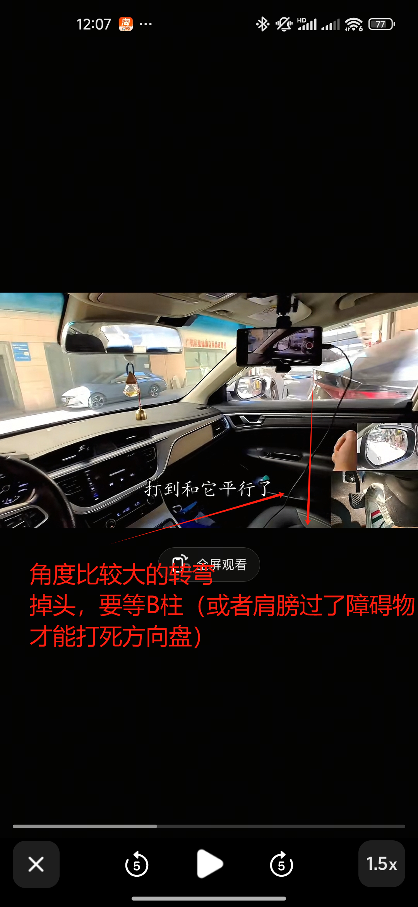
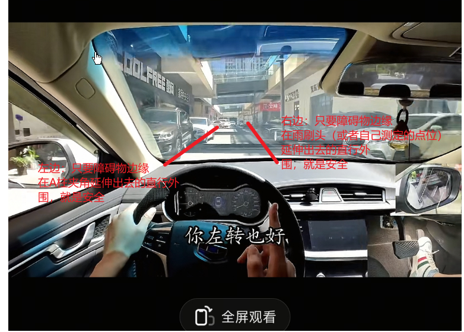
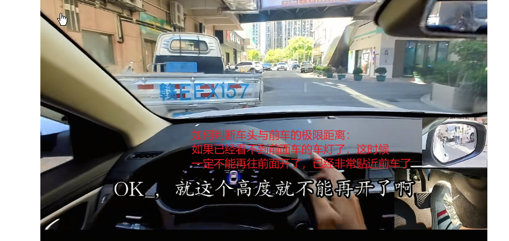
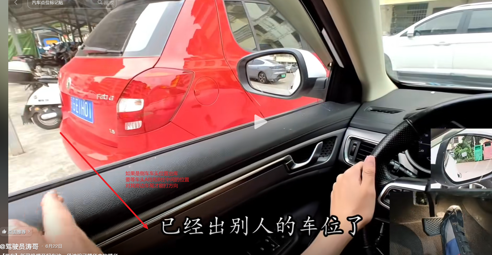
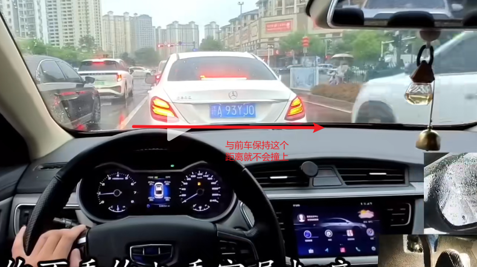
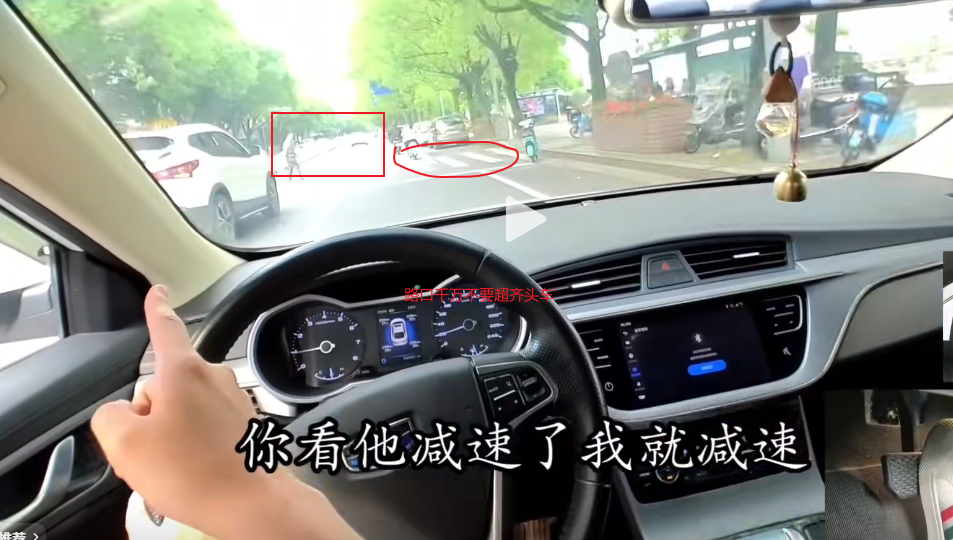

# 真实上路

## 驾驶基本原则
- **保持车道**：开车一定要开在&开好自己的车道，不能受其他车影响，就算后面有车乱按喇叭也不要理会
- **紧急情况处理**：越紧急越不能左右躲，直接减速刹车就行
- **避免压线**：注意一定不要压线行驶

## 变道技巧
1. **打转向灯**：先打灯
2. **观察后视镜**：看后视镜
3. **安全条件判断**：后视镜车辆靠近内侧就是安全的（距离越近越靠近外侧）
4. **加速变道**：提点速迅速完成变道动作

## 驾驶理念
**心态 > 意识 > 技术**

## 待解决问题
- 侧方位停车
- 倒车入库
- 倒车后退（回家练）
- 雨天/极端天气车内按键操作
- 车内按钮操作
- 练车重点地段/项目

## 学习建议
- **科目一复习**：定期刷科目一题目
- **陪练心态**：要全程按照自己想法来，教练会及时纠正错误

## 重要提醒

**注意力分配**：不要太注意速度表，要把注意力放在前方道路，保持与前车的安全距离

千万要注意养成：右脚不能来回移动地去踩油门和刹车，要保持脚后跟不动，然后正踩刹车，斜踩油门

不要一直盯着某一个固定的目标去看，要眼观八方，不仅要看前，也要顾后

倒车影像怎么判断距离

怎么通过后视镜判断车尾距离

怎么看路上有没有拍照摄像头

车载地图  设置不同语音？

要养成多看后视镜、内视镜，预防后方有危险情况的出现

看防御性驾驶视频

还有哪些独自上路，觉得是会被扣分的？

教练觉得我独自上路还有什么问题？

车上各种按键的操作？

新手上路常犯、易犯的错误？

自助取车流程？

安全头枕怎么调？

右转让左转 转弯让直行 如果都是直行则让右方车辆先直行

怎么使用M/S档位

开车在路上  一定要调整自己的车  保持各个方向都有最好的视线

一定要学会看路牌 

特别注意行驶在人多的地方 一定要多看后视镜  观察左右两侧的电动车和行人 

倒车入库和侧方位停车的时候，不要只看倒车影像，也要注意看后视镜

红绿灯路口停车等待的时候，如果前面是大货车，一定要保持足够的距离
## 相关图片

  

