# 真实上路

## 驾驶基本原则
- **4秒车距**：开车在路上，要一直要制造4秒车距（不要为了追求速度，而距离前车太近）
- **多看内视镜**：刹车前后一定要瞄一眼内视镜（特别是停车等红绿灯的时候），确认后方来车距离是否安全
- **要把车开在路中间**：开车要注意尽量开在路中间，不要为了特意去对A柱而开偏了
- **多看后视镜、内视镜**：养成每隔6秒看下后视镜 内视镜
- **保持车道**：开车一定要开在&开好自己的车道，不能受其他车影响，就算后面有车乱按喇叭也不要理会
- **紧急情况处理**：越紧急越不能左右躲（在没有确保后方左右安全的情况下），直接减速刹车就行
- **眼不到手不动**：哪怕是轻微的动下方向盘，也要确保眼睛已经观察到相应位置是百分百安全的，才能动方向盘
- **避免压线**：注意一定不要压线行驶
- **自动启停、自动驻车**：开车直接把自动启停开启、关闭自动驻车
- **保持良好的心态**：心态很重要，遇到事情 首先自己不要慌 要冷静
- **要轻踩油门**：每次启动车子的时候，给油一定一定一定要慢慢给
- **晚上开车一定要开灯**
- **养成通过仪表盘看档位的习惯**：要养成通过仪表盘看档位的习惯、不能低头去看档位确认挂的是什么档，每次要启动车子前，一定要重新看仪表盘对应的档位，和预想一致后才能给油（一定要注意，新手期尽量关闭自动驻车功能）
- **倒车入库看后视镜的方法**：倒车入库，不管是哪边倒，可以是首先主要关注靠近自己的一侧的后视镜。也就是左侧的后视镜。先把与左边的车的距离调好（也就是不宽不窄），确认左边不会剐蹭，再去看右边（但是也要注意瞄几眼右边的后视镜，预防剐蹭到右边的车）

## 变道技巧
1. **打转向灯**：先打灯
2. **观察后视镜**：看后视镜
3. **安全条件判断**：后视镜车辆靠近内侧就是安全的（距离越近越靠近外侧）
4. **加速变道**：提点速迅速完成变道动作

## 驾驶理念
**心态 > 意识 > 技术**

## 待解决问题
- 侧方位停车（加强&进阶练习）
- 倒车入库（加强&进阶练习）
- 倒车后退（回家练）
- 雨天/极端天气车内按键操作
- 车内按钮操作
- 倒车、侧方还需要练（加强熟悉度练习+专门练习各种不同路口的情况）
- 感受方向盘位置就是车轮位置的感觉，专门练习找点位压线走的车感
- 窄路的侧方、倒库（各种极端情况下的操作）
- 开车怎么省油？ 
- 不开灯的情况下,拉远光灯有没有？

## 学习建议
- **科目一复习**：复刷科目一题目

## 重要提醒

**租车前检查**： 租车开车前检查轮胎、车子有没有划痕之类

**注意力分配**：不要太注意速度表，要把注意力放在前方道路，保持与前车的安全距离

千万要注意养成：右脚不能来回移动地去踩油门和刹车，要保持脚后跟不动，然后正踩刹车，斜踩油门（每次开车都要特意去练习）

不要一直盯着某一个固定的目标去看，要眼观八方，不仅要看前，也要顾后（包括前方各个方向、内视镜、后视镜）

倒车影像怎么判断距离

怎么通过后视镜判断车尾距离（今晚）

怎么看路上有没有拍照摄像头（今晚）

车载地图  设置不同语音？（今晚）

要养成多看后视镜、内视镜，预防后方有危险情况的出现

看防御性驾驶视频

车上各种按键的操作？（明晚）

新手上路常犯、易犯的错误？（今晚看视频）

安全头枕怎么调？（头枕顶部齐平头的顶部）

右转让左转 转弯让直行 如果都是直行则让右方车辆先直行

怎么使用M/S档位（没试过）

开车在路上  一定要调整自己的车  保持各个方向都有最好的视线

一定要学会看路牌 （重要，黄底白黑字是省道、红底白字是国道、绿底白字是高速）

特别注意行驶在人多的地方 一定要多看后视镜  观察左右两侧的电动车和行人 

倒车入库和侧方位停车的时候，不要只看倒车影像，也要注意看后视镜

红绿灯路口停车等待的时候，如果前面是大货车，一定要保持足够的距离

雾灯怎么开？

极端天气怎么开灯？ 大雨天开雾灯 如果玻璃内起雾看不清，记得打开空调+外循环，有些车还有玻璃除雾功能，也可以打开，大雨特别是有积水的路段，要把自启停功能关掉，因为如果因为车子泡水熄火，是不能立马打火的

晚上开车 就算前方有车会车，但是看不远看不清前方路况时，也是可以开一两秒远光灯看一下的

车子起步前，是先挂档再松电子手刹（也就是按下p），停车后是先按下电子手刹（p）再挂入p档

看关注账号的倒车 入库视频（今晚）

起步的时候 一定要  二次确认好档位是否是和预想目的是一致的，今晚在窄路后退让车后，本来目的是想前进的。但是挂的是后退档，然后一脚油门下去。车往后面飞出去了，幸好没事，下次一定要注意（可以关闭自动驻车功能，这样松脚刹的时候，车子就会直接动起来，但是要注意等红绿灯这种情况，要踩下脚刹防止车子后溜，也可以进阶练习：每次踩油门的时候，要慢慢、轻轻的给油）

开车绕车走一圈

右变道时 要看下b柱盲区 左边的话 就是压线一会  观察有没车上来

眼不到 手不动

急弯  夜间弯 要按喇叭过或者双闪

## 相关图片

  
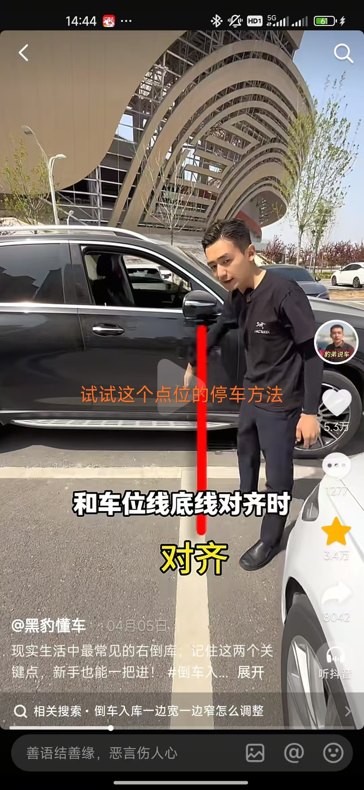  
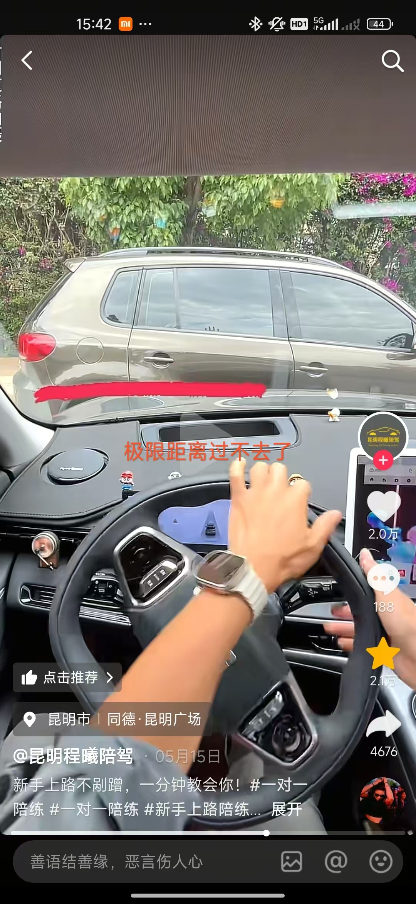  
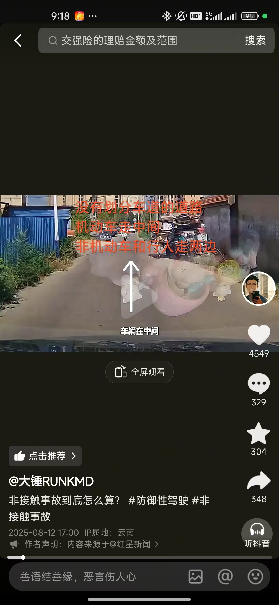  
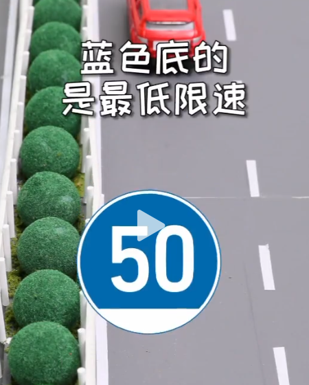  
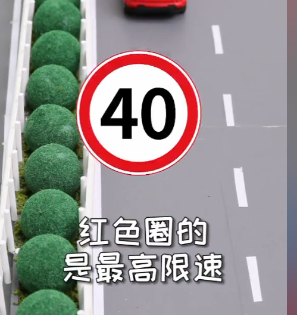  
  
  
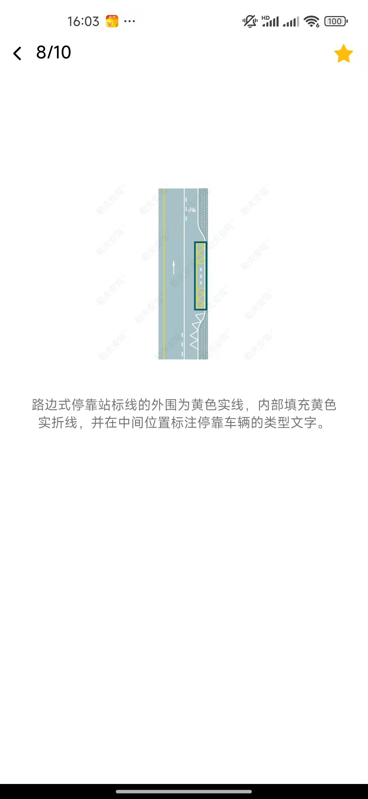  
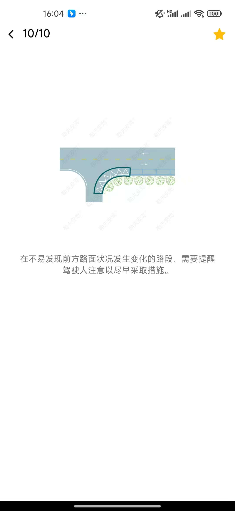  
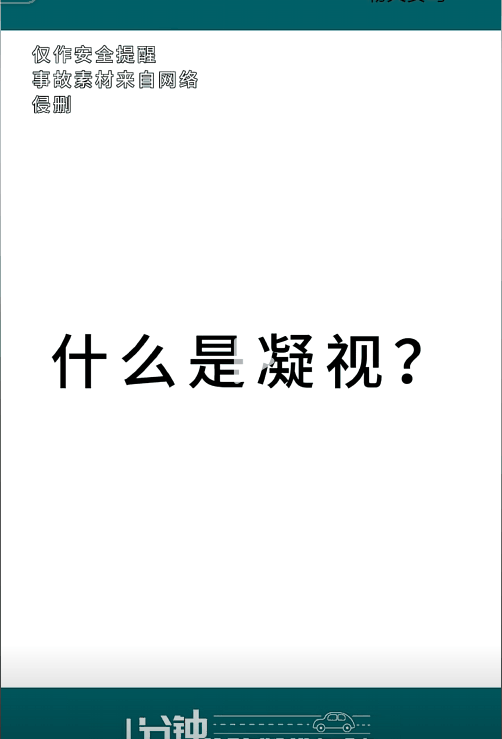  
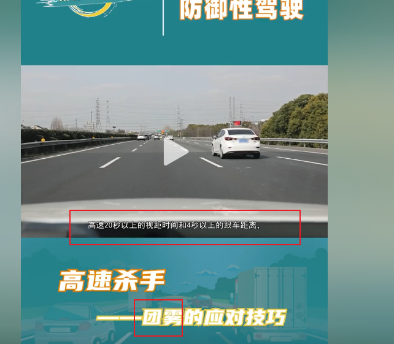  
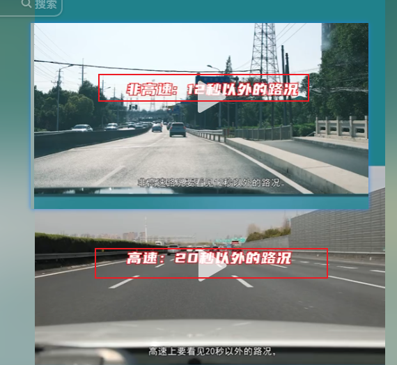  
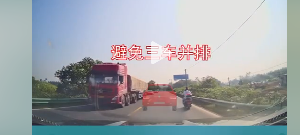  
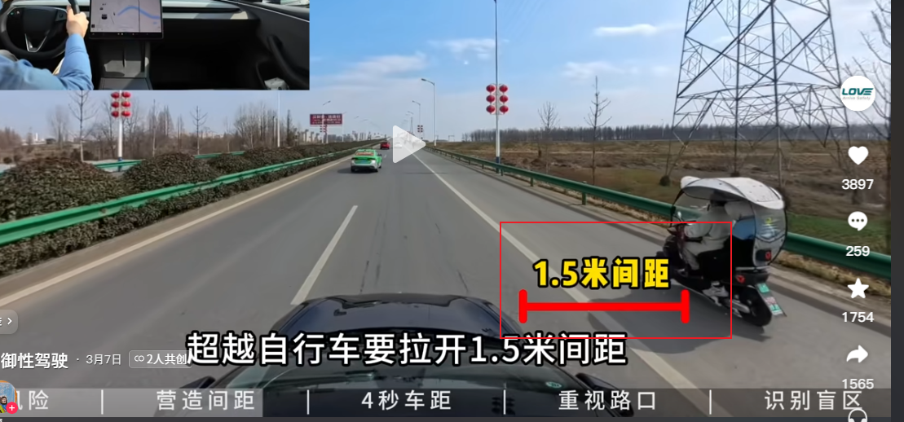  
 
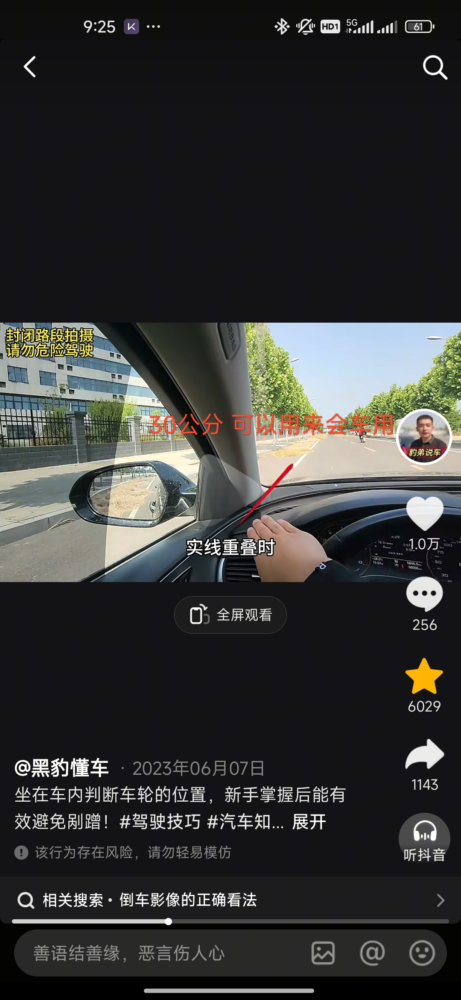  
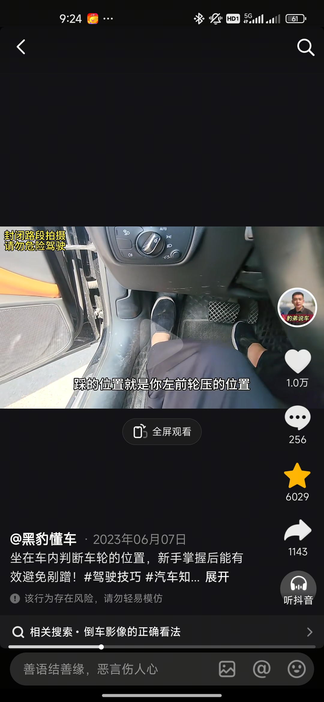  
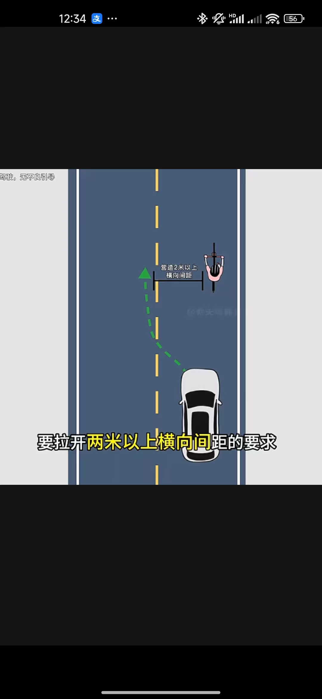   

