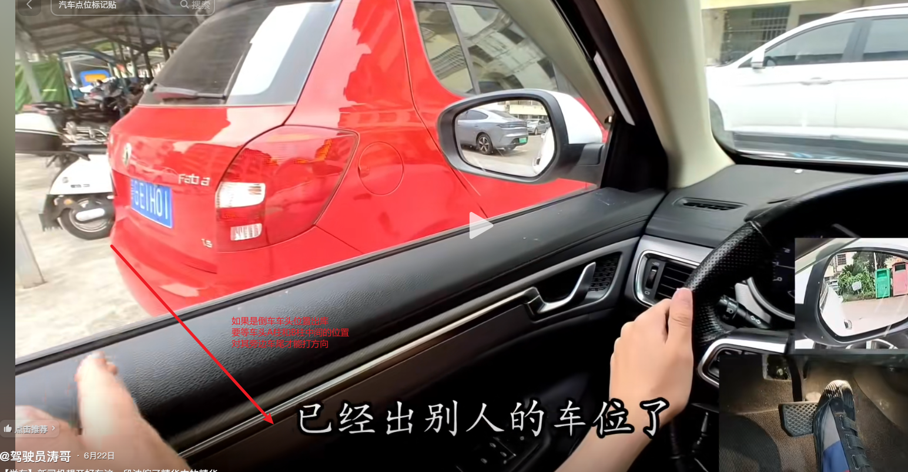
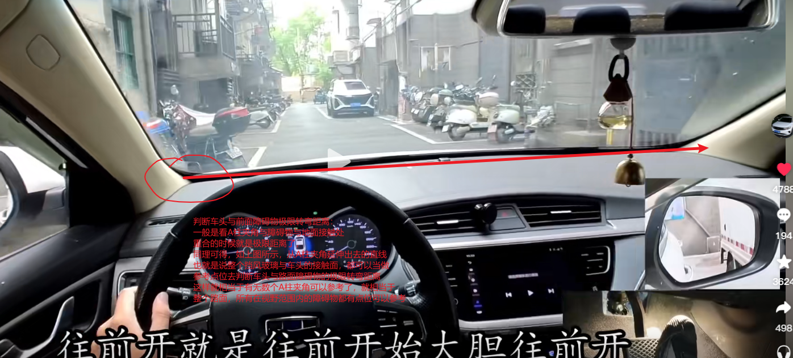
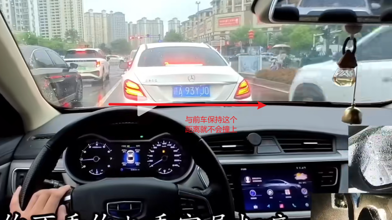
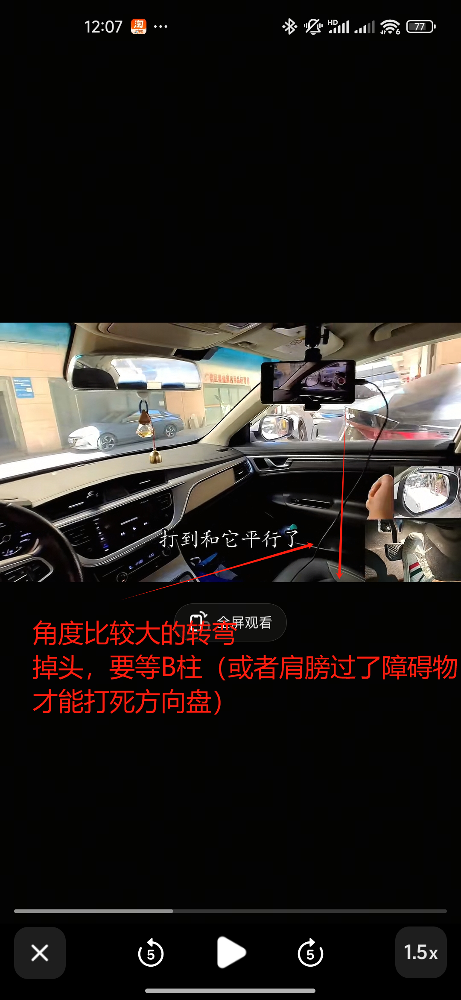
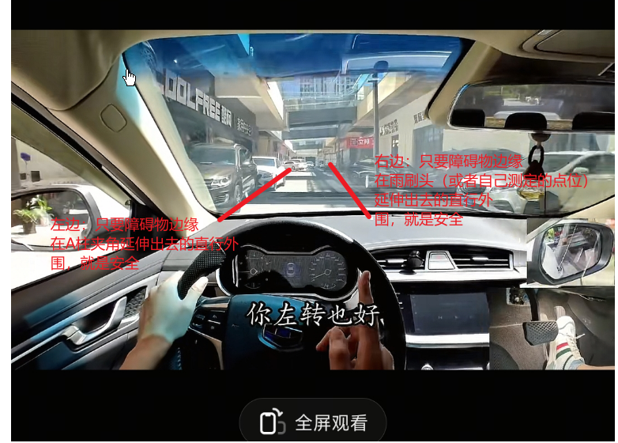
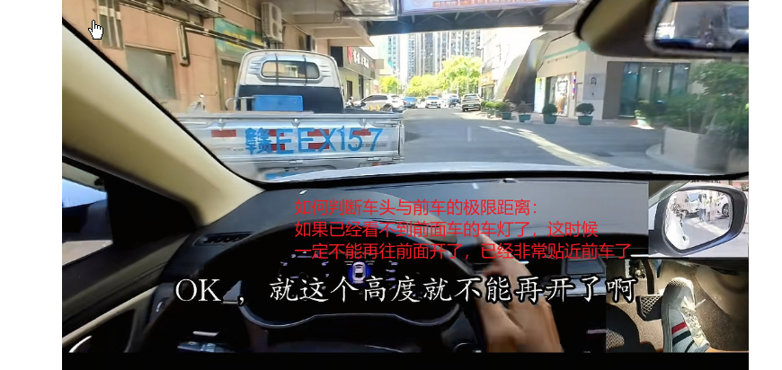

# 真实上路

## 驾驶基本原则
- **保持车道**：开车一定要开在&开好自己的车道，不能受其他车影响，就算后面有车乱按喇叭也不要理会
- **紧急情况处理**：越紧急越不能左右躲，直接减速刹车就行
- **避免压线**：注意一定不要压线行驶

## 变道技巧
1. **打转向灯**：先打灯
2. **观察后视镜**：看后视镜
3. **安全条件判断**：后视镜车辆靠近内侧就是安全的（距离越近越靠近外侧）
4. **加速变道**：提点速迅速完成变道动作

## 驾驶理念
**心态 > 意识 > 技术**

## 待解决问题
- 侧方位停车
- 倒车入库
- 倒车后退
- 雨天/极端天气车内按键操作
- 车内按钮操作
- 练车重点地段/项目

## 学习建议
- **科目一复习**：定期刷科目一题目
- **陪练心态**：要全程按照自己想法来，教练会及时纠正错误

## 重要提醒
**注意力分配**：不要太注意速度表，要把注意力放在前方道路，保持与前车的安全距离

## 相关图片

