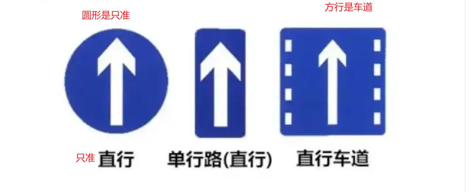
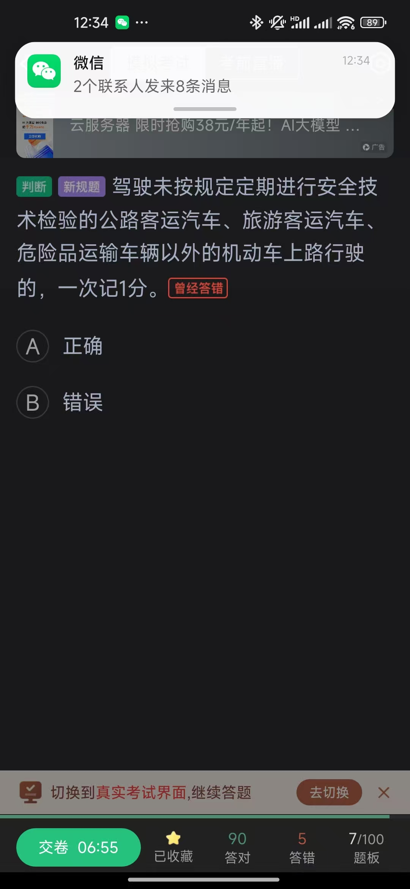
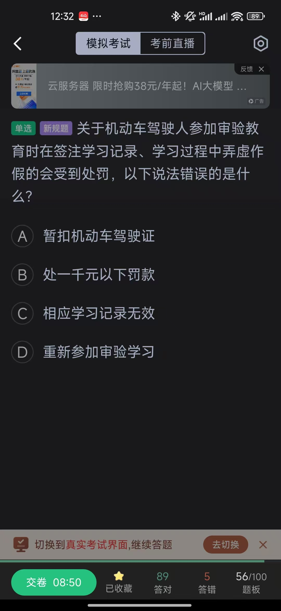
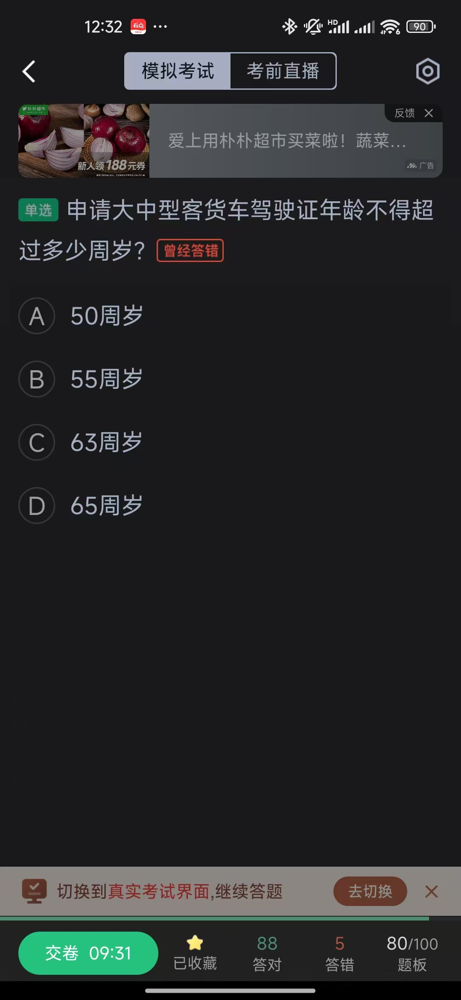
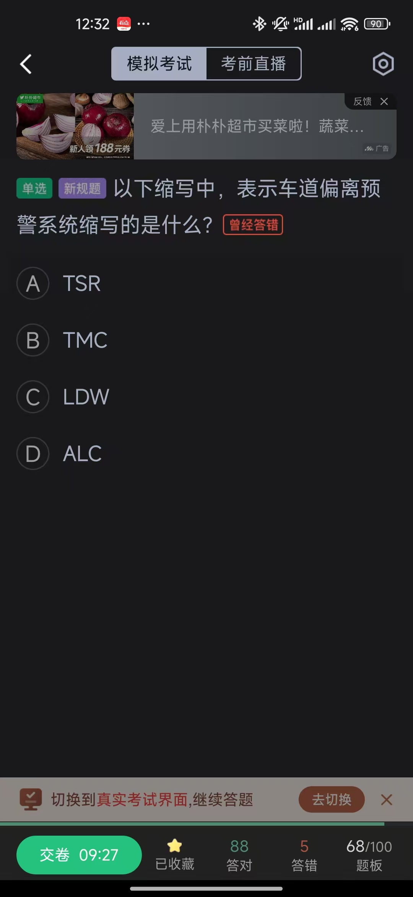
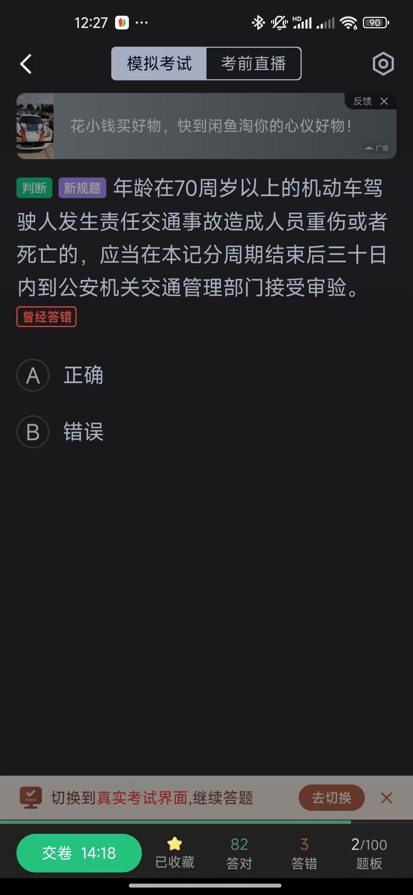
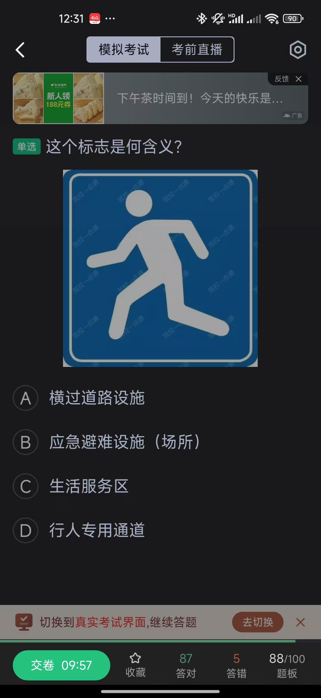
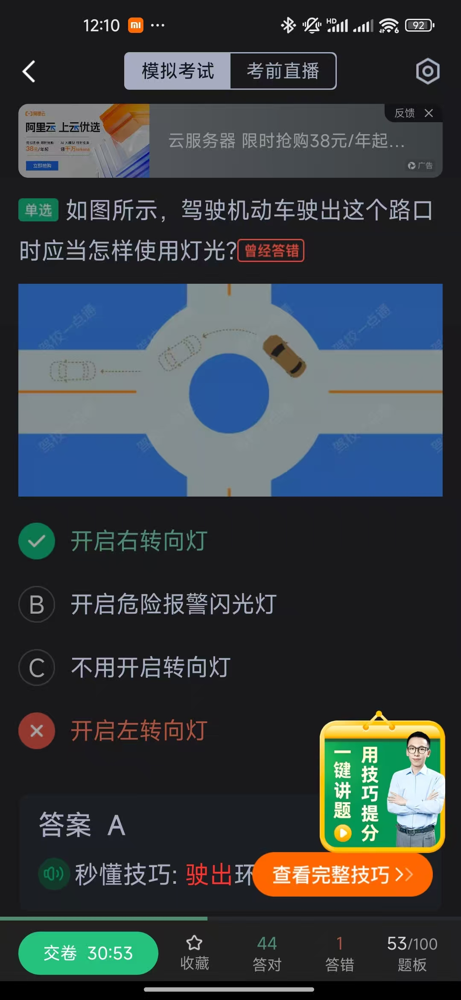

# 模拟考试错误收集

这里是模拟考试中收集到的易错题目和知识点总结。

## 常见错误图例

  

    
    
错误题目示例1

  

  

    
    
错误题目示例2

  

  

    
    
错误题目示例3

  

  

    
    
错误题目示例4

  

  

    
    
错误题目示例5

  

  

    
    
错误题目示例6

  

  

    
    
错误题目示例7

  

  

    
    
错误题目示例8

  

  

    
    
错误题目示例9

  

  

    
    
错误题目示例10

  

