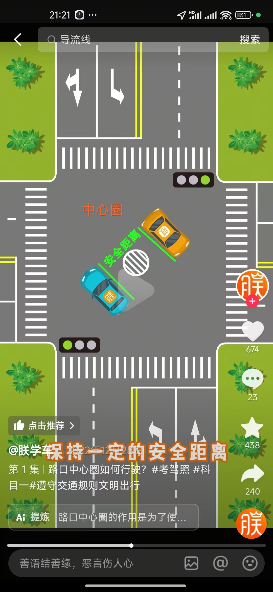
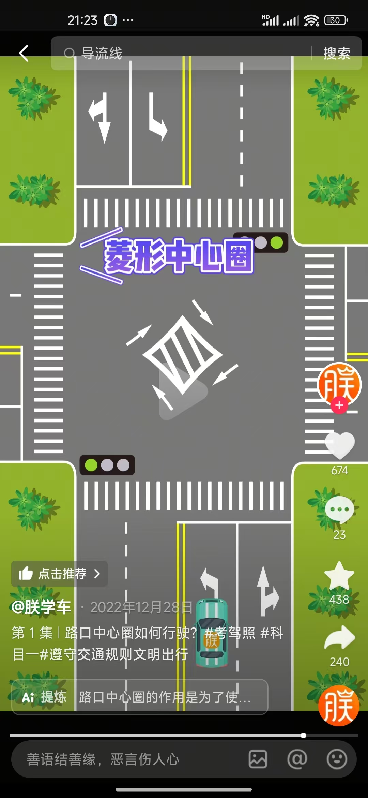
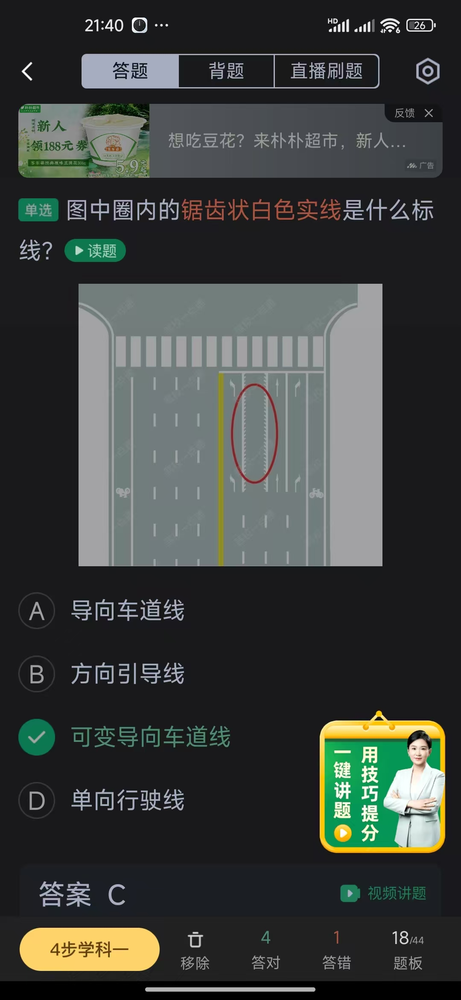
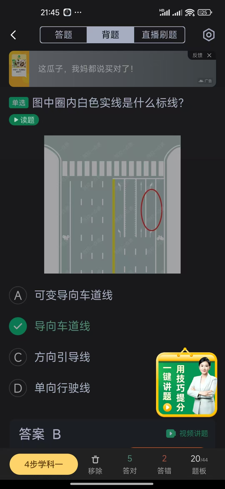
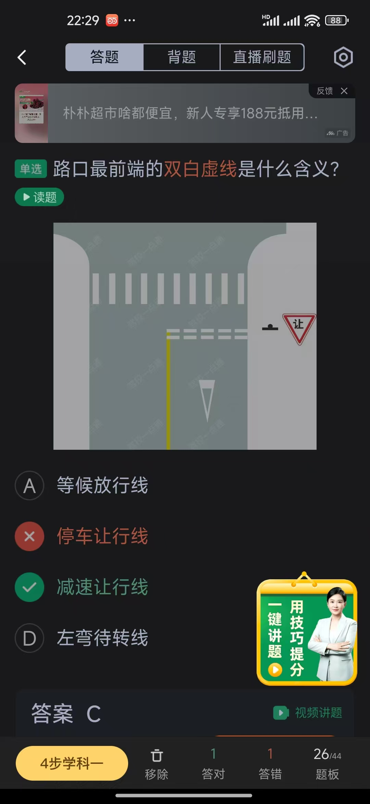
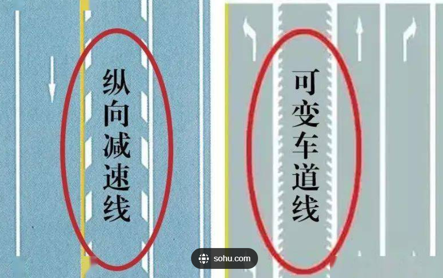

# 交通标线

  

    
    
标线示例1

  

  

    
    
标线示例2

  

  

    
    
标线示例3

  

  

    
    
标线示例4

  

  

    
    
标线示例5

  

  

    
    
标线示例6

  

  

    
    
标线示例7

  

  

    
    
标线示例8

  

  

    
    
标线示例9

  

  

    
    
标线示例10

  

  

    
    
标线示例11

  

  

    
    
标线示例12

  

  

    
    
标线示例13

  

  

    
    
标线示例14

  

  

    
    
标线示例15

  

  

    
    
标线示例16

  

  

    
    
标线示例17

  

  

    
    
标线示例18

  

  

    
    
标线示例19

  

  

    
    
标线示例20

  

   

    
    
标线示例21

  

