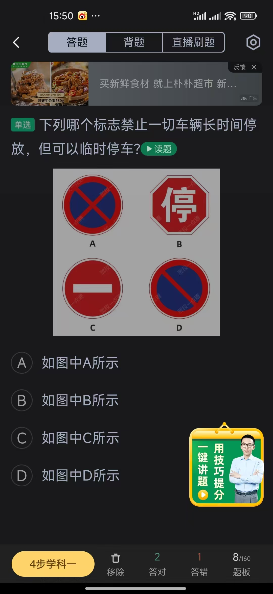
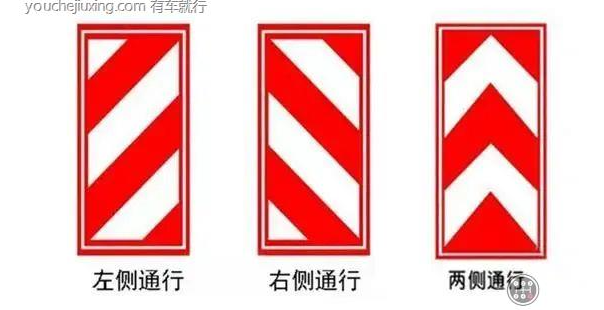
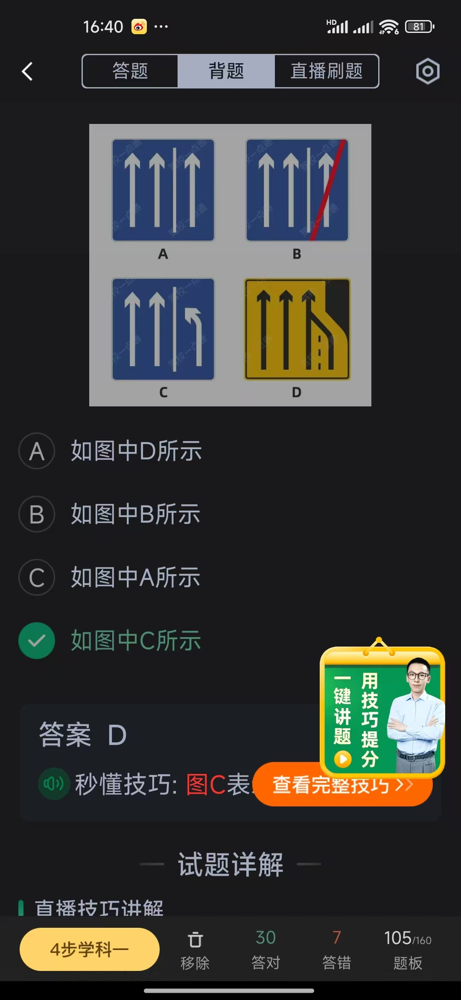
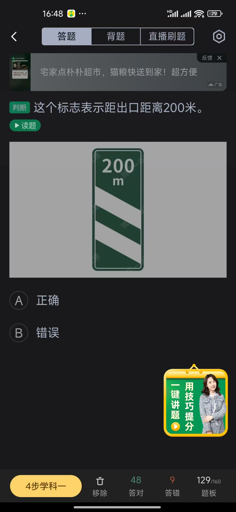
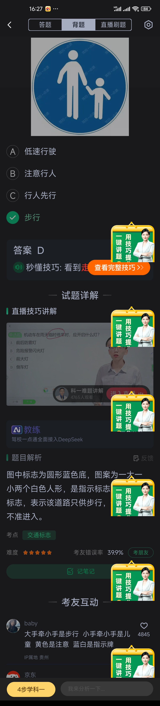
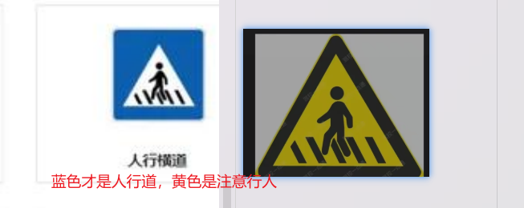
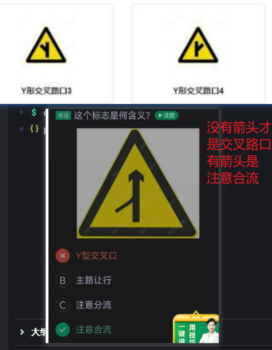
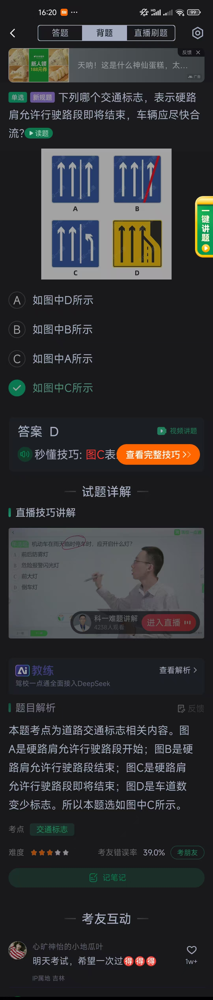
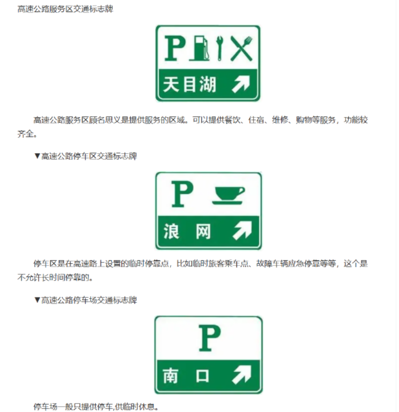

# 交通标记

  
  
  
  
  
  
  
  
  
  
  
  
  
  
  
  
  
  
  
  
  
  
  
  
  
  
  
  
  
  
  
  

<!-- 总结 -->

  <h3>总结</h3>
  <ul>
    <li>
      <strong>表示车道的图标两边肯定要有虚线才是</strong>
    </li>
  <!-- 图片添加 -->
  </ul>

  
   
    
     
 

<!-- 把images/summarize 目录下的图片都新增到该位置 -->
<!-- 注意页面的排列布局 -->

