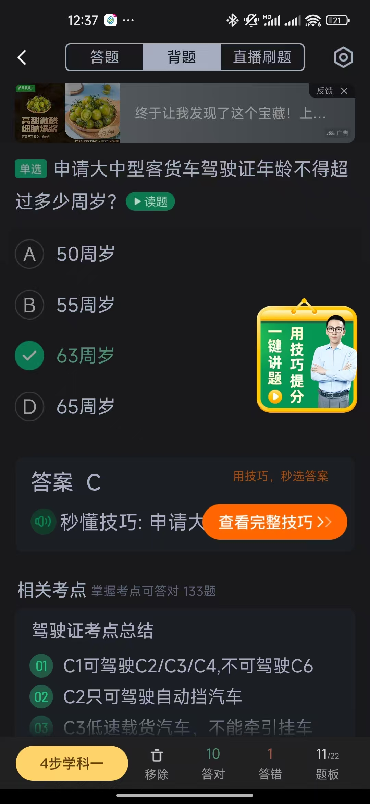

# 其他

  

    
    
题目1

  

  

    
    
题目2

  

  

    
    
题目3

  

  

    
    
题目4

  

  

    
    
题目5

  

  

    
    
题目6

  

  

    
    
题目7

  

  

    
    
题目8

  

  

    
    
题目9

  

  

    
    
题目10

  

  

    
    
题目11

  

  

    
    
题目12

  

  

    
    
题目13

  

  

    
    
题目14

  

  

    
    
题目15

  

  

    
    
题目16

  

  

    
    
题目17

  

  

    
    
题目18

  

  

    
    
题目19

  

  

    
    
题目20

  

  

    
    
题目21

  

  

    
    
题目22

  

  

    
    
题目23

  

  

    
    
题目24

  

  

    
    
题目25

  

  

    
    
题目26

  

  

    
    
题目27

  

  

    
    
题目28

  

  

    
    
题目29

  

  

    
    
题目30

  

  

    
    
题目31

  

  

    
    
题目32

  

  

    
    
题目33

  

  

    
    
题目34

  

  

    
    
题目35

  

  

    
    
题目36

  

<h2 class="summary-title">驾考要点总结</h2>

  

    <h4 class="summary-card-header">通行规则</h4>
    

      
右转让左转 转弯让直行 如果都是直行则让右方车辆先直行

    

  

  

    <h4 class="summary-card-header">安全教育扣减相关</h4>
    

      
在最近 3 个记分周期内，只要是饮酒+受过处罚的,不得参加教育扣减

      
实习期不能参加教育扣减

    

  

  

    <h4 class="summary-card-header">学习驾驶证明</h4>
    

      
学习驾驶证明有效期是 3 年

      
学习驾驶证明意思是：驾驶技能准考证明，是在科目一考试合格之后，车管所发给我们的一个正在进行驾驶证考试学习的证明

    

  

  

    <h4 class="summary-card-header">年龄限制</h4>
    

      
轻型牵引挂车：20-70 岁

      
大中型客货车：<strong>20-63 岁</strong>,其中申请大型客车、重型牵引挂车准驾车型的，在<strong>22周岁以上，63周岁以下</strong> 

    

  

  

    <h4 class="summary-card-header">车型代号口诀</h4>
    

      
一客二货

    

  

  

    <h4 class="summary-card-header">考试次数</h4>
    

      
科二科三：不能超 5 次（给你一只手的机会）

    

  

  

    <h4 class="summary-card-header">审验相关</h4>
    

      
驾驶人因服兵役、出国(境)新规题等原因无法办理审验时，延期审验期限最长 3 年

      
涉及到审验的时间限制都是在记分周期结束后 30 日内

    

  

  

    <h4 class="summary-card-header">换证规定</h4>
    

      
过了换证期限但是未超过两年的，参加道路交通安全法律、法规和相关知识考试合格后(也就是只需要考科目一)恢复驾驶资格

      
其中驾驶证超过有效期一年的，会自动被注销，如果是超过 3 年还没换证的，就要重新考

    

  

  

    <h4 class="summary-card-header">车辆管理所</h4>
    

      
人核，车登，换居(人:驾驶证、车:与机动车相关、换:换证)

    

  

  

    <h4 class="summary-card-header">饮酒驾驶处罚</h4>
    

      

        <h4>普通机动车（非营运）</h4>
        

          
<strong>首次饮酒驾驶：</strong>

          <ul>
            <li>暂扣驾驶证 6 个月</li>
            <li>罚款 1000 元至 2000 元</li>
            <li>记 12 分</li>
          </ul>
          
<strong>二次饮酒驾驶：</strong>

          <ul>
            <li>处 10 日以下行政拘留</li>
            <li>罚款 1000 元至 2000 元</li>
            <li>吊销驾驶证(牌没了，没有扣几分说法了)</li>
          </ul>
        

      

      

        <h4>营运机动车</h4>
        

          <ul>
            <li>吊销驾驶证，5 年内不得重新取得</li>
            <li>处 15 日行政拘留</li>
            <li>罚款 5000 元</li>
            <li>重新取得驾驶证后，10 年内不得驾驶营运车辆</li>
          </ul>
        

      

    

  

  

    
醉酒驾驶处罚

    

      

        <h4>普通机动车（非营运）</h4>
        

          <ul>
            <li>吊销驾驶证，5 年内不得重新取得</li>
            <li>判处拘役（通常 1-6 个月）</li>
            <li>并处罚金</li>
          </ul>
        

      

      

        <h4>营运机动车</h4>
        

          <ul>
            <li>吊销驾驶证，10 年内不得重新取得</li>
            <li>重新取得驾驶证后，终生禁止驾驶营运车辆</li>
            <li>判处拘役并处罚金</li>
          </ul>
        

      

      
<strong>注意：</strong>单纯饮酒驾驶机动车仅涉及行政处罚（如罚款、暂扣/吊销驾照等），单纯醉酒驾驶仅构成危险驾驶罪，最高判处拘役。只有因醉驾导致重大事故、恶性冲撞或伴随其他犯罪，则可能升级为交通肇事罪，那么就可能面临牢狱之灾。

      
饮酒驾驶导致重大交通事故并构成犯罪 = 终生禁驾

    

  

  

    
汽车系统简写

    

      <ul class="abbr-list">
        <li><strong>LDW</strong> - Lane Departure Warning 车道偏离预警系统</li>
        <li><strong>ALC</strong> - Auto Lane Change 车辆提供的一种辅助驾驶系统</li>
        <li><strong>TSR</strong> - Traffic Sign Recognition 汽车安全系统的交通标志识别系统</li>
        <li><strong>TMC</strong> - Traffic MessageChannel 交通信息频道</li>
        <li><strong>ACC</strong> - Adaptive CruiseControl 自适应巡航，又称车辆主动巡航系统</li>
        <li><strong>FCW</strong> - Forward Collision（碰撞） Warning 前方碰撞预警系统</li>
        <li><strong>BSD</strong> - Blind Spot Detection 盲点监测系统</li>
        <li><strong>AEB</strong> - Autonomous Emergency Braking 自动紧急制动系统</li>
      </ul>
    

  

