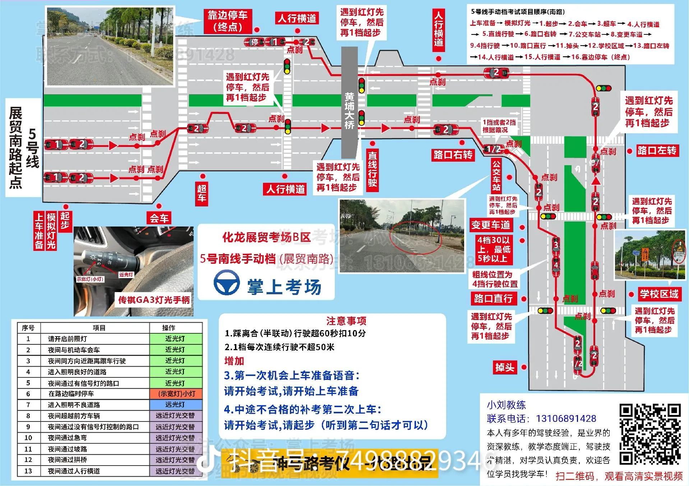

# 科目三实操总结

- 最开始考试起步的时候，别忘记先打左转向灯

- 需要打灯的地方意识还是不够，一定要注意提前打灯（比如变更车道）

- 提前背好路线，要点刹的地方一定不能忘记

- 起步的时候，要记得半联动不要太过了，感觉抖动了就可以松脚刹了，如果松完脚刹车还不动，再稍微松下离合就行，如果半联动太过，车子就会一下去冲出去，或者会熄火，半联动状态看到速度达到 5 码后，直接放心松完离合

- 打转向灯的时候，没有特别注意百分百安全、并且 3 秒后，就打方向盘了。这个要注意，下次练习时，要变道或者转弯了，先打转向灯，这时候千万别急，一定要左右看后视镜，确保百分百安全后（包括 b 柱位置），并且够三秒后，再动方向盘，包括换挡也是，首先不要急，目的不是实现快速换挡，而且要准确换档，最快最慢最多也就差一秒，不差那一秒时候，步骤一定是先快速把离合踩下去，然后再慢慢换挡，正确换完档，再松完离合，这时候再去控制油门，把速度控制到匹配档位

::: tip
**变道一定一定要看 b 柱，下次练习重点**
:::

- 开车视野一定要看宽一点，不要只顾前面，也要顾下左右的路况，特别是路口

- 方向盘打得有点不规范

- 变道、掉头、转弯一定要看两边的后视镜+B 柱位置（考试的时候，是看是否有左右摇头看的动作，当然不是为了考试，就单纯随便左右摇下头，真实开车上路，是肯定要左右看后视镜确认安全才做出相应后续动作的）

- 特别是左掉头，一定要看右边的来车，右转弯或掉头，一定要看右后方来车

- 车停下后等待的时候（比如停车等红绿灯）一定要踩刹车，起步的时候也一定要踩住刹车（防止后溜）再松离合

起步步骤

- 起步步骤一定是离合、刹车同时踩死，然后挂一档，松手刹，然后松离合，找到半联动后定死离合，直接放完脚刹，让车走起来速度达到 5 码后就完全松开离合，松完离合后，有条件（有距离）就带点油门加速到 15 码左右，立马换二挡，如果没有距离加速，为了一档不超 50m，可以选择停车（但是不能停在斑马线和路口）

不加速直接上二挡的方法

- 不加速直接上二挡的方法（但是在考试中，不能长时间二挡+低速行驶，因为系统会判速度与档位不匹配，所以就算不加速直接挂二挡，也要立马提速，考试尽量不用）：
  直接不加速挂二挡，要注意这时候离合一定要慢慢松，因为速度很慢，松的太快会熄火（前提是一档起步后，要完全松一次离合后，再重新踩离合挂二挡，因为如果踩着一档的离合没有松完就又踩死离合换二挡，系统会判断为越级挂档，然后会扣分，不过这种不加速直接上二挡，因为速度很慢，如果长时间出于慢速，系统会判为速度与档位不匹配，也会挂科，所以低速就算挂上二挡后，也要马上提速，考试中为了保险，还是少用这种方法，宁愿停车重新起步）

- 反正注意起步一定要踩住刹车再慢松离合，找半联动，然后速度达到 5 码，立马松开离合，不用担心车走起来后，松离合车子会熄火，只要起步后车子不熄火，就算挂着档不加油，车子是也不会熄火的，所以成功起步后，可以放心松离合，离合需要用到的地方:换挡的时候，停车的时候（减速的时候不需要踩），起步的时候，其他时候脚放开离合位置

::: tip
整个开车过程中，要注意速度与档位的匹配。**二挡不能超过 30，这个一定要注意**
:::

::: tip
**特别特别注意的就是:踩离合的时候，右脚一定是放在刹车的位置的，一定一定要注意不要一边踩着离合一边又加油，这样会造成空转，反正就是，只要左脚在离合位置，右脚就一定要放回刹车的位置，一定要养成这个习惯，只要右脚准备斜踩油门了，先提前左脚松开离合，全部离开离合位置，右脚才能斜踩到油门位置**
:::

防止离合、油门同时踩的练习方法

- 防止离合、油门同时踩的练习方法:只要两只脚同时抬起来的时候，肯定是左脚在离合，右脚在刹车，也就是右脚是正的，不能是斜的，一定要左脚放到空闲位置后，右脚才能斜，反复这样练习，形成肌肉记忆，反正就是，脚无非就是两种情况，左右同时抬起来，那么肯定是左脚离合，右脚刹车（正摆），要么是只有右脚抬起来，这时候右脚要么是刹车要么是油门，就不会空转，说白了，只要左脚抬上来，右脚就一定要正放到刹车上，不能斜放

- 降档的时候，油门要重踩，尽量快一点把速度降下来

- 做加减档的时候，视野一定要看前方的道路，不能看着档位换挡，还有就是右手换挡的时候，左手就不要调方向盘了，一定是在做加减档之前就把车身摆直了

- 掉头的时候要先停下车，然后重新挂一档起步，如果感觉右方有来车或者其他情况过不去。就再次停车后再起步，同时注意尽快升二挡，掉头的时候，方向盘要直接打死

- 变更车道的时候。也是有距离要求的，如果刚好发现后方车太多，变不了道，就停车等待，挂好一档，重新起步。变好道后，及时上二挡

- 直线行驶视野一定要看远一点，余光瞥一下 A 柱夹角或者路上箭头左尖尖，发现位置差不多后，就不要老是看近处了，要看远

- 换挡的时候，一定要先把车摆直，然后发现车直后，再右手去换挡，这时候左手一定不能动了，并且一定要看前方，不能低头看档，这里还是要注意，一定要左脚全部松完后，才能右脚踩油门，要养成换挡的时候，右脚松开油门后，先把右脚回到刹车位置，然后左脚踩离合，换完档，左脚放完离合，左脚离开离合位置，右脚才能动，才能斜踩给油

- 车走起来后，方向盘打的幅度一定不能太大，就算是移动的角度很大，也是给一点点方向，然后慢慢过渡

::: warning
还需要加强的地方就是:遇到突发情况，比如说突然前面的车停下来了、要变道的时候发现距离不够，首先不要慌，要提前判断出下一步怎么走，不要一遇到这情况就想着停车。先试着想办法解决问题。比如前方突然停车，可以在条件允许的情况下变道，然后再回到原来车道，实在实在不行了，最后才使用大招停车重新起步就行（不能停在斑马线或者路口）！
:::

- 车开在路上的时候，一定要注意力集中，时刻要眼光八方（看宽一点），看情况路况，时刻明确下一步自己要干嘛，然后时刻观察路面情况，预测到与自己的目标有冲突的情况时，要稳住，不能急，然后灵活去处理！

- 下次练习，要把教练当安全员，路上遇到所有情况自己判断，不要问教练怎么走之类的！

- 路上可能会有很短的实线。注意不能在实线变道或者压线的。
- 4 换 2 的时候，直接离合踩死、刹车踩重一点，降速到 30 后，松开脚刹，就可以换 2 档（因为这时候已经踩死离合了）。
- 正确踩油门的方法：用脚尖斜着去踩，重点就是不要接触面积很大。
- 背熟路线，注意所有地方的点刹和转向灯。
- 加减档加速油门不够重，不要太轻踩（时间拖太长了），要尽量快速完成加减档，因为路上情况变化快，避免夜长梦多。
- 一档换二挡的时候，直接油门踩重一点，直接一脚油门就可以上二挡了，不需要再低头确认看速度表，一档换二挡速度不要那么匹配的，也就是说不一定要到 15 再上二挡，不过要注意二挡的时候，松离合最好要慢点松，不要一下子松完（这个要注意，包括 4 减 2 也是要慢抬离合）。
- 转弯的时候，判断车头是否能安全通过前方障碍物的方法：只要在 a 柱夹角与前方障碍物和地面接触处重合之前打死方向盘就可以过。
- 危险距离判断（一定要停车了）：如果看到后视镜（左）下沿和障碍物与地面的接触处已经重合了，此时车头离障碍物只有 20 到 30 公分的距离了，这时候如果是转弯的话，肯定是过不去的，不过可以使用这个方法作为停车时，判断车子停止的时机。
- 记住找半联动的时候，是脚后跟后移的，而不是脚后跟定住，然后直接抬脚尖，找到半联动，让车走起来后，可以使用脚尖去控制。
- 换挡的时候也是，反正只要是踩死离合，然后松离合到半联动这区间，肯定是脚后跟移动，慢慢松离合的。
- 考试的时候，跟车距离一定要远一点，至少要看到一个箭头的距离，因为需要点刹的地方，是看到箭头一定要点刹的，如果箭头都看不到，错过点刹就不合格了。
- 所有需要打灯一定要过三秒才能操作。
- 如果有紧急情况，是可以在路口短暂停车的，但是千万千万注意，不能停止斑马线上。
- 起步一定要打左转向灯。
- 最后最后，在考试前，一定要在心里默默告诉自己，所有操作都不着急、所有操作都不着急、所有操作都不着急，除了加减档，使用二挡控制速度在 25 码左右，一般情况 25 码的速度，就算有紧急情况，也是可以来得及刹车的，只要不要慌，错把油门当刹车就行，所有说，不要慌，退一万步讲，旁边还有安全员，放轻松正常操作就行。把速度控制在 25 码左右，告诉自己，所有情况都是可以来得及处理的，脚没事不要乱踩油门就行，遇到紧急情况，首先右脚离开油门，备在刹车上，实在要停车了，就不要犹豫，直接踩死离合，踩刹车。

-----------

## 考试线路图 

