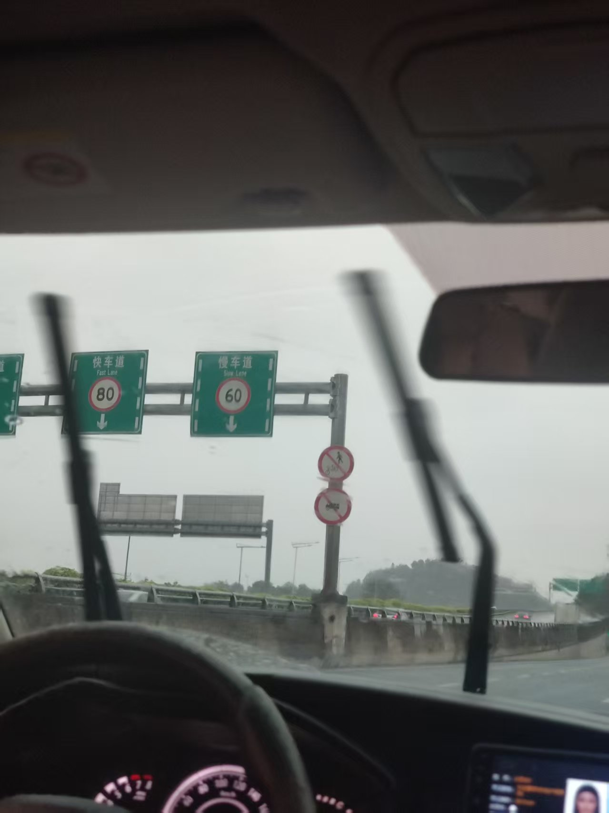

# 科目三 C1 练车要点归类总结

## 一、上车准备

- **第一步**：上车关门，交替两下灯光复位。
- **第二步**：调整座椅（脚试两下离合，觉得合适就行，一般不用调镜子）。
- **第三步**：上车做完准备要记得等语音播放才能下车绕车一周。
- **第四步**：告知安全员准备就绪。

## 二、灯光操作要点

- **远光灯复位**：如果远光灯是最后一组灯光，下一个灯光报关闭灯光时，需先回近光灯，再扭到off。
- **开启远灯光**：操作远光灯时，推的时候要小心，手指按死固定，避免斜推切换到其他档位。
- **双闪灯**：打双闪灯时一定要慢，太快系统可能识别不出来（包括其他灯光，一定不能抢灯光）。

## 三、项目操作通用技巧

- **上下车**：下车上车都务必随手关门。
- **起步**：绕车一周后，上车完成灯光操作并听到“请起步”语音提示后，再打左灯起步，等待约5秒，切勿一绕完车上车，灯光还没做，就直接打左灯。
- **档位挂挡**：防止有些车辆挂挡困难，一档和二挡时向左的力尽量大一点。
- **点刹**：所有需要点刹的位置都要点两下。
- **速度控制**：除加减档和起步用一档外，其他路段直接二挡保持20码速度即可，2档20码足够匹配了。
- **转弯与掉头**：特别留意转弯和掉头位置的点刹，即将到达时心里提醒并多点刹几次。
- **考试绕车一周**：点按钮最好也点两次。
- **操作后复位**：操作完项目后，务必复位灯光。
- **超车**：一定要听到第二次语音提示才操作，而且超车的项目记住不要加油，怕过了距离，特别是4号线。

## 四、直线行驶要点

- **方向盘**：双手轻轻扶住方向盘，调整方向不能瞬变，要有过渡和渐变，幅度不能大。
- **视线**：一定要看远，感觉方向有偏再轻微调整，不要一直在那里左右晃动。

## 五、靠边停车要点

- **提前打灯**：靠边停车记得先提前打左转向灯。
- **停车起步**：不管前面有没有车，都一定要停车重新起步，以防万一。

## 六、特定路线与项目细节

### 4号线

- **公交车站**：4号线做完直线行驶有条件，就可以开始提前打左灯变到最左车道了，因为接下来的项目是左掉头

### 5号线

- **公交车站**：写有长长公交车字样的公交车站，特别注意要前中后各点一下。
- **左转车道**：到了二人雪中左转这条路时，尽量走左二车道进行左转，其他车道可能受大货车影响。
- **加减档补做**：如果是要补做加减档，要过了路口的学校后才可以补加减档。
- **靠边停车**：在最后一个斑马线前（也就是二人桥中追游艇的最后的人）停车重新起步。

### 4、6号线

- **起步第一个右转路口**：一开始出来路口时，尽量停两次车重新起步（前面没车不停的话，一定要记得在黄色箭头处点刹）。
  - **第一次停车**：右转前的黄色箭头处回一档停车重新起步。
  - **第二次**：右转完，过来后的雪糕桶（6）、实线尽头处（4），都需要停车重新一档起步。只不过4号线要注意一下，实线尽头处有一个小坡度，尽量不要把车停到坡度上，避免增加重新起步的难度，都是为了一档超50m。
- **一档半联动**：一档半联动不要拖太久，半联动也有超时限制；一档过5码后立马松完离合。

- **方向盘操作**：4号线是右打死，6号线是右打一圈

### 6号线

- **变道**：超人会抵制的人行道过了有条件可以提前左变一条道（为了前面的左掉头）。
- **人桥**：只有人时，可以在桥底过了自主右变一条道，也可以过了第二个人行道再自主右变一条道。

## 七、考试通用注意事项

- **考试结束**：一定要等语音播放“考试结束”后才能松安全带。
- **车道保持**：要尽量把车开在路中间，因为两边的实线不能压。
- **遇车阻挡**：考试时即使前面有车挡住，也不能超车；如果没有距离，就只能停。
- **靠边停车结束后**：先回空挡，再拉手刹（考试务必按照此顺序）。
- **转向灯操作**：打了转向灯一定要等5秒才能操作（技巧：打了灯，过5秒再看确认后视镜是否安全，不要一打了灯就看后视镜，容易一看到安全就变过去，可能还没够5秒）。
- **灯光复位**：操作完项目后，务必复位灯光。
- **留意车道线**：车在开的时候，要留意两边的线，可以偶尔看下后视镜，防止压线。
- **起步松离合**：起步松离合时，一定要松到半联动时定住，不要一直松；等过了3秒左右或速度达到5码左右，再直接放开。但也要注意，不要压着太久，半联动压太久有时间限制。

### 靠边停车

4号线的靠边停车位置: 过了图片所示两个牌子，有一根喷了灰色的电线柱

5号线的靠边停车是在最后一个斑马线前（也就是二人桥中追游艇的最后的人）停车重新起步

6号线的靠边停车位置

## 重点注意的问题

### 1. 常见错误

- **灯光复位**：打了灯做了项目，没有复位。

### 2. 考试心态与操作

- **心态**：正式考试时，一定不能急，挂挡一定要慢慢来，并且全神贯注。
- **节奏**：一路慢慢开，一边开一边心里预告下一步的操作步骤及注意事项，一定要很明确自己下一步该做什么。

### 3. 离合与油门操作

- **4号线坡道起步**：
    - **离合松法**：一定要注意离合的正确松开方法，脚后跟慢慢后移找半联动。
    - **抖动判断**：只要感觉车身有明显抖动（不要不敢松，一有轻微抖动就定住），立马顶住脚，任何部位都不能动。
    - **松刹车后**：如果松开脚刹车还没动，要再放点离合，但不能直接抬脚尖，否则会熄火。
    - **脚后跟控制**：离合不管什么情况下，都是脚后跟移动去控制，任何情况下都不能抬脚尖。
- **离合与油门不能同时松**：
    - **切勿慌张**：考试时，即使有安全员或后面车辆催促，都不要慌张，直接抬离合和松油门会导致熄火。
    - **半联动**：离合肯定要慢慢移动脚后跟，松到半联动，然后顶死，再松刹车。
    - **松油门时**：松油门的时候，一定不能同时松离合。
    - **稳住节奏**：考试一定要稳住，按照自己的节奏来，不要受环境的影响。
    - **溜车处理**：如果顶死离合的半联动，松开脚刹后，车感觉后溜，一定要第一时间把离合和刹车踩死，然后重新起步！
- **半联动感觉**：松离合找半联动的时候，可以感觉强烈一点再定住，就怕给的抖动感觉不是很明显，松脚刹之后会溜车。

### 4. 特定项目注意事项

- **调头**：所有的调头都要使用一档，如果条件允许，可以不停车，但是一定要回一档。
- **加减档**：考试时加减档一定一定要等前方没车后，有条件后再做，感觉稍微没机会，都不要做。
- **5号线起步后**：打左灯起步后，一直保持到路口会完车，进去到路口后，再关闭掉左灯，然后接下来是超车，再重新打左灯。
- **学校点位**：考试的时候，学校点位也要点刹，练车的时候，说不超30码就不用点。

### 5. 红绿灯路口处理

- **非第一部车**：如果停在路口等红绿灯的时候，如果不是第一部车，那么一定一定一定要注意在箭头处点刹。
- **点刹后加油**：一定一定一定要点完刹再加油上二挡，不要为了50m内加油上二档直接冲过路口而忘记点刹。
- **灵活变通**：如果是中间隔着多部车（证明距离路口的箭头比较远），但是还是绿灯可以过的情况下，就要加油上了二挡到路口箭头再点刹，要灵活变动。