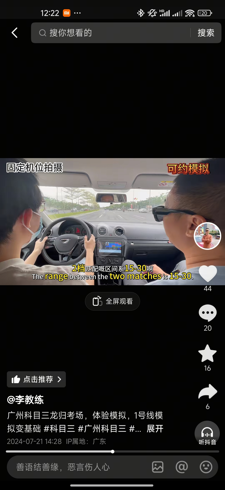

# 预习笔记

## 驾驶技巧

*   **参照点判断安全距离**：
    *   日常开车上路，左边看A柱夹角。
    *   右边看雨刷头右边凸点作为判断与障碍物安全距离的参照点。

*   **车轮位置判断**：
    *   左边轮子位置就是左边方向盘边缘的延长线。
    *   右边同理。

*   **方向盘操作**：
    *   一般路上开车，正常打半圈方向盘转弯就够了。
    *   如果是掉头可以打满。
    *   根据实际情况加减：距离越大、速度越大，方向盘幅度就越小；距离越小、速度越慢，方向盘幅度就越大。
    *   转弯（非掉头）的时候。可以直接打半圈方向盘。然后根据实际情况加减

*   **档位与速度控制**：
    *   整个考试过程中，一档行驶的距离不允许超过50m。
    *   如果在期间挂其他档位，或者停车重新起步，那么50m的距离会重置。
    *   一档起步时，要慢慢抬离合，一般逐渐慢抬个5秒左右，或者速度走到5km/h以上，再把离合松完就不会熄火了。
    *   降档记得慢松离合，升档快松。

*   **停车技巧**：
    *   停车要留足够距离，提前踩离合拖刹。
    *   要踩刹车的话，一定要轻踩。

*   **驾驶注意力**：
    *   只要车动，就要看远方。
    *   只能使用余光看A柱夹角来判断车与路左右的位置，不能看档位来换挡。

## 考试要点

*   **细节&&重点**：

    *   在考试的时候，只要是需要打转向灯、或者是点刹的地方，都需要看下左右后视镜，这个细节很重要，否则会被扣分。 

    *   考试中，如果不是加减档，就二挡保持20到30码行驶。因为需要点刹的地方速度不能超过30码

    * 不管是转弯还是掉头，都要过了后轮过来斑马线再打方向盘？因为在斑马线不能停车

    *  考试的时候，变道时候的速度保持在20到30码，然后方向盘角度不能超过45°，比如是右变道，那么就是右打45°，然后等车头盖过一半虚线。往左回45°，然后车正就回正

    *  不管是左变道还是右变道，都是看到后方来车靠近镜子内测才是安全的，如果看到车出现在镜子外侧，那就证明车子离得比较近

    *  注意变道时候，不能只看后视镜，还要看B柱夹角位置

---

## 私教学习目标

* 直线行驶
* 加减挡位操作
* 变更车道
* 靠边停车

---

## 图片参考

<!-- 把images 文件夹中的图片 那种命名升序，全部显示在这里 -->

### 图片 1

### 图片 2

### 图片 3

### 图片 4
