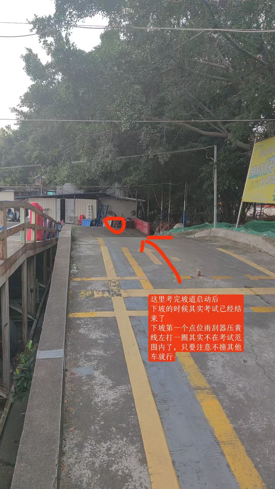
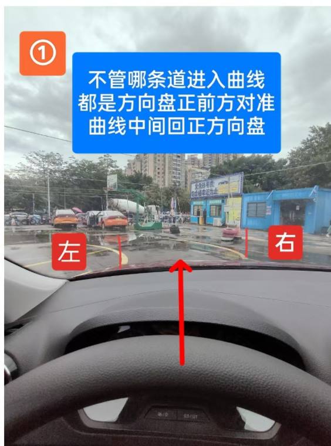

# 科目二考试注意事项

## 基本操作

> **上车第一件事**：一调二系三检查，挂挡准备启动前，一定要离合、脚刹踩到底、然后检查车门关好、安全带系好、手刹松到底后才能起步

::: warning 重要提示

  

    一、调整座位
    <ul style="margin-top: 5px; margin-bottom: 0;">
      <li>调整座椅前后位置，确保能舒适地踩到踏板</li>
      <li>调整靠背角度，保持良好的驾驶姿势</li>
        <li>调整座椅上下高度，确保坐直头顶离车顶一拳头左右的位置，切记不能调得太高</li>
    </ul>
  

  
  

    二、系安全带
    <ul style="margin-top: 5px; margin-bottom: 0;">
      <li>确保安全带平整无扭曲</li>
      <li>系紧安全带，不要过松或过紧</li>
    </ul>
  

  
  

    三、检查事项
    <ul style="margin-top: 5px; margin-bottom: 0;">
      <li>后视镜：检查并调整到适合自己的位置</li>
      <li>档位：确认是否在空挡(只要确认车是启动没有熄火的，又没有踩死离合，就一定是空挡)，不是空挡直接启动发动机会直接挂科</li>
      <li>启动状态：检查车辆是否已启动，已启动状态下再次点火会造成熄火，扣10分</li>
      <li>手刹：手刹和挂挡没有前后顺序，但不放手刹就起步会直接挂科(所以先放手刹再挂挡)，确认仪表盘红灯全部熄灭后才能起步要么就直接挂科</li>
    </ul>
  

:::

  

::: danger 🚗 侧方位停车相关 🚗

# 侧方位停车

:::

## 追线与停车要点

- **追线规则**：只有一次追线机会，否则挂科，并且注意训练场是追雨刮器最右边凸点压黄线一半，考试的时候是追雨刮器最右边凸点压黄线内线
- **追线规则**：追线一停车 马上挂科（到了点位才能停）
- **内场训练**：肩膀对着左边雪糕桶就停
- **考试场和外场**：肩膀对着左黄线尽头(左边线缺口)停车
  - 缺口处必须处于两轮之间，否则挂科

## 侧方停车扣分细则

1. 车辆入库停止后，车身出线扣 **100 分**
2. 行驶中车轮触压车道边线扣 **10 分**
3. 未停车于库内，扣 **100 分**
4. 起步未开左转向灯或者转向灯操作错误，扣 **10 分**
5. 中途停车每超 2 秒扣 **5 分**
6. 从挂倒档开始计时 90 秒操作完成，否则挂科

## 操作技巧

想要练得好，连贯起来，需要注意以下几点：

- 每到一个点位车速最慢
- 方向盘操作要快准狠
- 追线那里停一次，库里停一次

::: tip 侧方位停车重要提示

  
🚫

  

    停车限制：对于侧方停车这个项目，除了上述两次停车，其他地方是不能停车的，也就是说不能踩脚刹（当然是针对手动挡来说），所以练习中要养成中途不踩脚刹的习惯
  

  
💡

  

    灯光使用：起步、转向、变更车道、超车、停车前要提前 3 秒打对应灯光（侧方就是出库时要提前打左转向灯）
  

  
⏱️

  

    打火注意：上车的时候一定要检查是否已经打火，如果车子已经打火，就不能再打了。而且注意打火整个流程不能超过 3 秒
  

:::

## 强化练习目标

- **方向盘要在心中**：打方向盘的时候不能眼睛盯着。
- **不能随便踩脚刹**：除了两个点位（追线停车、侧库停好车后），全程不能动脚刹（踩一次扣 5 分）。
- **出库打灯**：出去的时候记得右手重压打左转向灯（灯要打了 3 秒后才能出库）。
- **出库慢速与点位切换**：出库的时候速度一定要慢，注意左股线和雨刷左边参照物之间的点位切换，防止方向盘跟不上节奏。
  - **进阶技巧**：尝试不寻找雨刮器参照点，凭感觉人在马路中间时直接右打方向盘一圈。
- **方向盘操作与后视镜观察**：
  - 方向盘左打死后，**先看左后视镜**，确保方向盘打死的瞬间车轮压线，
  没有压线就右调一点，看到车轮进入黄线内，再左打死。
  - 如果感觉进不了线，**立即右打半圈方向盘**进行修补。
  - 确认车轮进线后，再**左打死**。
  - 最后**看右后视镜**，看到平行就停车。
- **离合控制**：练习教练教授的离合控制方法，把车速控制得既慢又稳（中途每停车超两秒扣 5 分）。
- **计时练习**：专门练习在 90 秒内完成操作。

  

::: danger 🚗 倒车入库相关 🚗

# 倒车入库

:::

## 倒车入库注意事项

  
1

  

    考场虚线差异：考试的时候是在江高考场，由于江高考场和训练场虚线不一致，所以倒车入库时，在考试的时候，追线的时候是追左往右数，第二第三条虚线中间。
  

  
2

  

    追线禁停：追线中途不能停，一停 100分。
  

  
3

  

    座位调整：座位一定要每次都调得差不多。
  

  
4

  

    后视镜观察：最后倒车进到库后，后视镜（倒右库就是看左后视镜，倒左库就是看右后视镜）看到稍微前宽后窄就行，不要调到视觉平行，然后找点位停车。
  

  
5

  

    右入库回正时机：右倒车入库的时候，当前门把手一半齐平库角延长线的时候，方向盘右打死后的回正时机是看见库角出现一指宽的时候（注意要低头去看）。
  

  
6

  

    车速控制：车速要慢慢慢、离合要控制得稳稳稳。
  

  
7

  

    方向修整：看见库角回正方向盘后，不是就直接不管了，而是要稍微修整下，达到后视镜（倒右库就是看左后视镜，倒左库就是看右后视镜）看到是稍微前宽后窄。
  

  

## 倒车入库实操复盘总结

### 倒库技巧

#### 左倒库

- 左倒库第一个镜子下缘点位要拍下（结论：比右倒库宽一点）
- 左倒库把手的点位要确定好（留意延长线）
  - 今晚练习只是凭感觉，下次不能这样
  - 需确定非常明确的参照点
- 右倒库和左倒库（特别是左倒库）时，留意下右后视镜与黄线的距离，左倒库是最后看右后视镜回正时，感觉很窄了。但是下去看实际还是挺宽的（这个也需要再确认下）

### 速度控制

- 半条虚线和门把手这两个点位之间，速度一定要慢（因为这两点位相隔很近）
- 每个点位即将到达时，速度也要放慢
- 离合有进步，但还需继续改进

### 方向盘操作

- 手打方向盘时，手不能离开方向盘
- 要做到快，但不能垂直幅度很大
- 否则会误碰到其他开关导致扣分
- 打方向盘要按照规范来，要永远知道自己的方向盘在什么位置（也就是往哪个方向打了多少圈）
- 也不能看着档去操作档位

### 考试准备

- 所有考试项目的点位都要非常明确
- 明确什么时机、位置应该做什么事
- 不能只凭感觉靠大概
- 练习时可用手机拍下所有对应点位的车内看点
- 每次上课练习前，先在心里过一次点位
- 实操时严格按照点位练习

  

----

## 倒车入库重点总结

### 入库点位要点

- **镜子下沿点位**：不管右入库还是左入库，第一个镜子下沿点位很重要
  - 右入库：一节黄虚线宽
  - 左入库：一节黄虚线宽多一点点（注意不能超过一节半）
- **点位识别技巧**：即将到达点位时，就复制粘贴一节宽虚线到前方，不断重复复制粘贴到前方

### 左右入库技巧

- **右入库完后准备出库**：
  - 左镜子中要看到后车轮与地点接触点（也就是凹点压到库角黄线外线再左打死（防止打太早）） 
  - 要把车身与左边库留充足的距离
- **左入库特殊情况**：
  - 镜子下沿与虚线离得比较远时，把最近的黄虚线在心里延长，当成一条实线去看
  - 使用复制粘贴方法与镜子下沿对比（标准是一节虚线多一点，不能超过一节半虚线宽）
  - 宁愿打早也不要打晚

### 观察与调整

- **观察技巧**：门把手与直角延长线这个点位，要用余光去看，不要死盯着库角
- **回正时机**：不管右入库还是左入库，最后进到库里面后，后视镜出现库角一指宽的时候记得回正，然后再微调到前宽后窄就停车
  - 右入库：看左后视镜出现库角一指宽就回正
  - 左入库：看右后视镜出现库角一指宽就回正
## 曲线、直角弯、坡道复盘

**通用点：**

- 追道路右侧黄线：
  - **侧方停车**：雨刮最右侧凸点追黄线**内线**（训练场追黄线中间）。
  - **其他项目**：雨刮最右侧凸点追黄线**一半（中间）**。
  - **注意**：下次训练需确认追外线是否有压线风险。坡道停车后，右车身距离黄线 0-30cm 不扣分，30-50cm 扣 10 分，大于 50cm 扣 100 分。

### 整个流程总结

## 一、坡道重点

- **追线**：
  - 雨刮最右侧凸点压黄线**中间**去追。
  - 追到坡底准备上坡时，追右往左数，第二和第三条虚线中间。
- **上坡操作**：
  - 上坡道的过程中停车**不能动离合**，只能踩脚刹。
  - **停车点位**（一定要坐直坐正，车速要慢）：左后视镜下沿超中间粗线（约两条普通虚线宽）一半（即一条普通虚线）时迅速脚刹踩死停车。
  - 拉一半手刹（不能拉满）3 秒，放手刹（这里记得一定要先放手刹,确认仪表盘红灯灭以后，再松脚刹，要不手刹不拉直接启动车就会挂科），松脚刹，车走后脚刹松完。
- **下坡操作**：
  - 离合踩死（断掉动力传输），让车惯性前行。
  - 下坡过程靠脚刹控速。
- **下坡第一个点位**（正常考试下坡的过程已经考试结束了，下坡不算坡道考试范围了）：雨刷头右侧压黄线左一圈，人正回正，然后追线。

## 二、曲线、直角重点

- **第一个直角位**（训练场特定，考试可能没有，反正遇到直角要转弯都是一样的以门把手后边缘作为打死的点位）：

  - 车把手后边缘（训练时粉笔标记处，需练习无标记情况）与直角平行时，左打死（其实就是直角转弯）。
  - 雨刷即将压黄线时回正（平行看雨刷，压侧库第一条平行线）。

- **准备进入曲线**：
  - 黄线缺口（就是尽头）对准肩膀，左打一圈（侧方停车出来后的第一个点位）。
  - 雨刷头碰黄线就停车回正（然后先停车，这时候还不是进入曲线项目考试区域，可以停车），**立马右打死**。
    - 雨刷头碰线就回正然后右打死进入曲线（近线路），或者雨刷头碰线，直接右打死进入曲线（远路线）
  - 进入曲线，人正（感觉人在曲线中间，或者方向盘十二点方向对准中间  ）就回正。
- **曲线行驶**：
  - 最左鼓线压黄线**内线**，左打一圈，保持最左鼓线沿黄线内线走。
  - 鼓线脱离黄线内线时，看左边，左鼓线压左黄线内线时回正。
  - 雨刷最右边凸点压黄线，右打一圈。
  - 头挨着车门看，保持车把手后外边缘（练习时白色粉笔线最外侧点）沿着内线走。
- **出曲线**：
  - 看到左缺口，身体回正。
  - 雨刷最右边凸点碰黄线一半回正，手向下压死灯。
  - 右手控制追线（黄线一半）。
- **直角转弯操作**：
  - 门把手后边缘线对齐直角延长线，左打死（左一圈半）。
  - 车正回正，追线去考坡道。

### 下次训练目标（待解决问题）

- 确认追线时，追黄线内线和外线的距离差距（√）？
- 坡道扣分点具体有哪些？
- 训练场有两条进入曲线的路线，第一个直角转弯路线怎么走（√）？
- 左倒车入库后，出来往右边走考下一个项目（√）
- 拉一半手刹（不能拉满）3 秒，放手刹（这里记得一定要先放手刹，确认仪表盘红灯灭以后，再松脚刹，要不手刹不拉直接启动车就会挂科）

## 特别注意的点

- **坡道刚上坡时**：方向盘**左带 45 度**（不是 90 度（1/4 圈））两秒钟（因车上坡会自动右偏），然后回正。
- **坡道停车后再启动**：方向盘也要**先左带 45 度**，然后再松脚刹启动车，1 秒回正，防止右边压线。

## 第一节曲线练习课复盘

- 坡道上坡停车时，**记得千万不要动离合，只能踩脚刹停车**
- **方向盘要按照规范来打**。
- **坡道上坡前追线追雨刷头右边压黄线一半**。
- **曲线行驶时，最左股线和门把手后边缘点位，尽量拉回内线里面一点点，都不要完成压着内线边缘走（怕压线）**。
- **离合控制到车动时，就不能移脚后跟了，要使用脚尖去控制车速，这个要练熟**。
- **所有项目所有点位考试前一定要背熟，特别是方向盘打的圈数**。
- **车行驶到所有点位时，速度一定要慢，要不然方向盘打的不够快，速度又很快，就有压线的风险**。

### 其他

- 不同线路进入曲线回正的方法
- 
