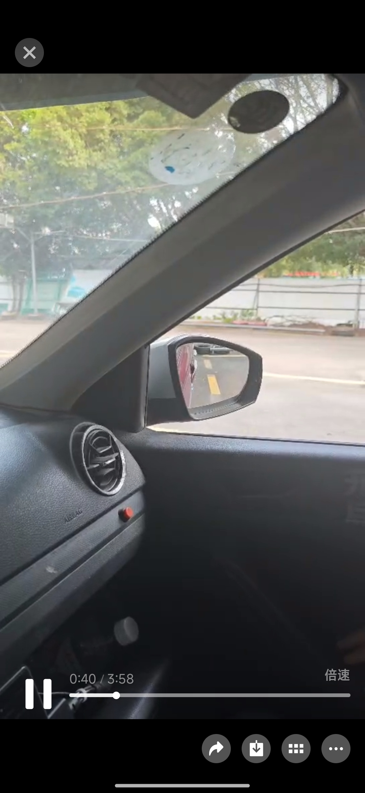
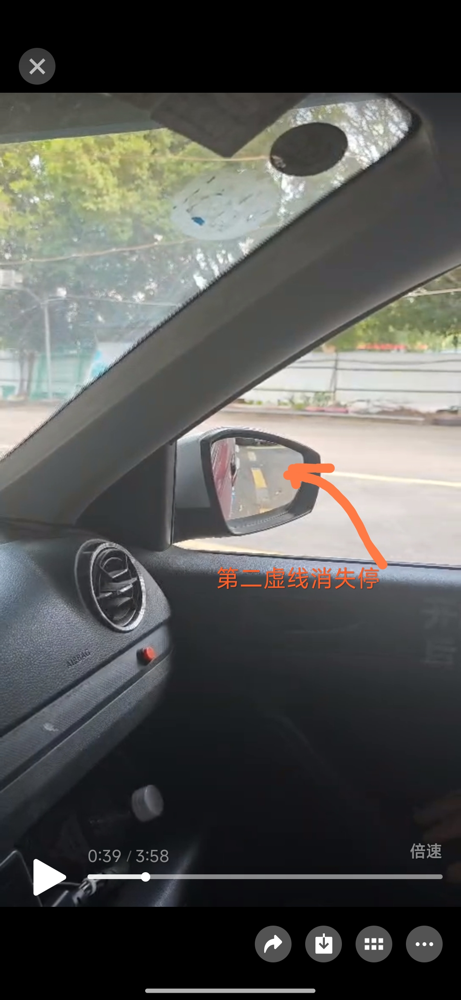
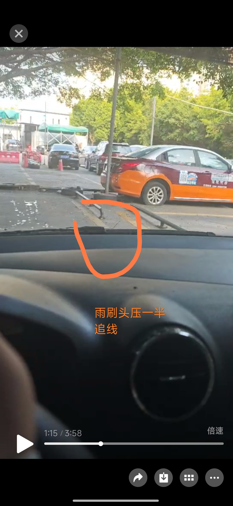
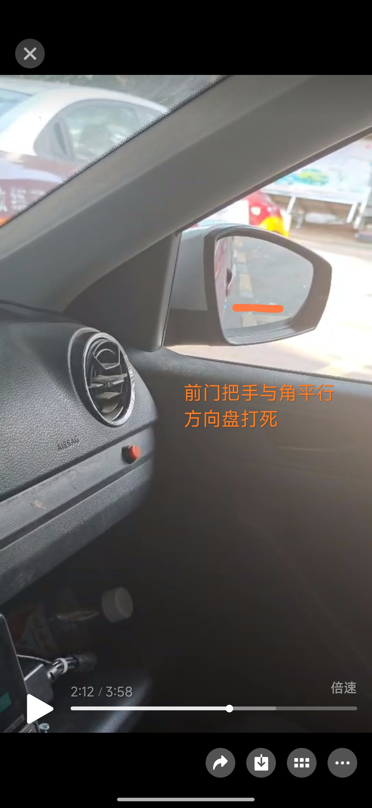
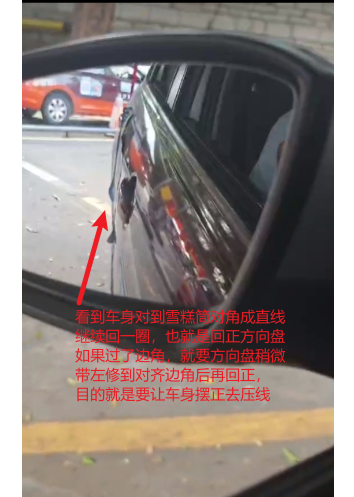
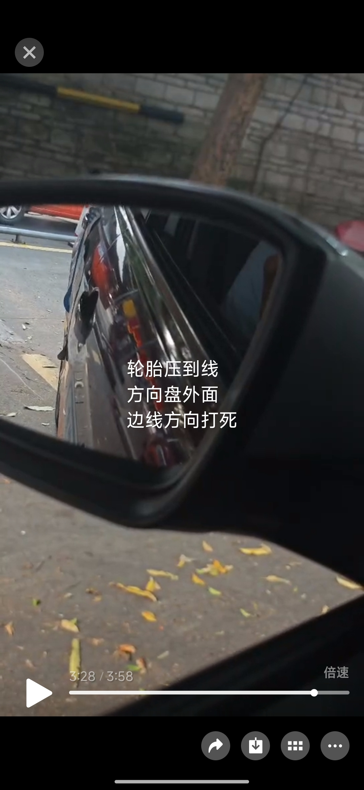
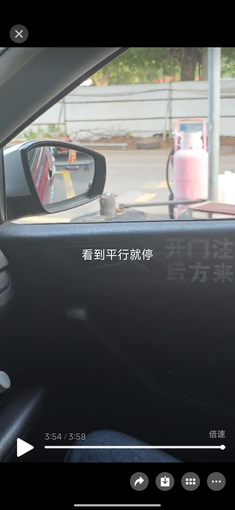
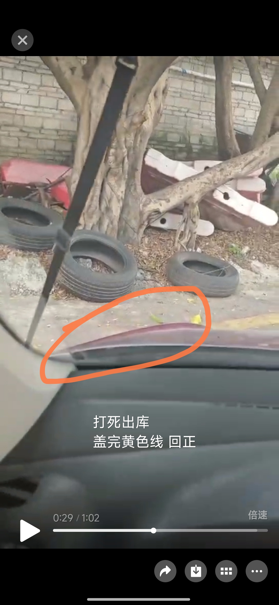
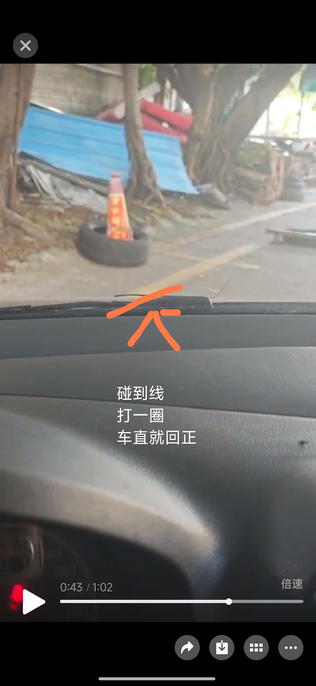

# 科目二图文说明

::: danger 🚗 侧方位停车图解教程 🚗

  <h2 style="background-image: linear-gradient(to right, #ff8a00, #e52e71); -webkit-background-clip: text; color: transparent; text-shadow: 0px 2px 2px rgba(0,0,0,0.2); padding: 10px 0;">侧方位停车操作图解</h2>
  
按照以下图示步骤操作，轻松掌握侧方位停车技巧

  

    
步骤1-2

    
    
  

  

    
步骤3-4

    
    
  

  

    
步骤5-6

    
    
  

  

    
步骤7-8

    
    
  

  

    
步骤9-10

    
    
  

  

    

      
操作要点

      <ul style="margin: 0; padding-left: 20px;">
        <li>注意观察参照物</li>
        <li>控制车速均匀</li>
        <li>方向盘操作要准确</li>
        <li>合理使用后视镜</li>
      </ul>
    

  

:::

## 全步骤总结

### 侧方位停车操作步骤

  
1️⃣

  
<b>看到库角一指，右打死</b>

  
2️⃣

  
<b>看左后视镜</b>，一节半虚线回半圈，看到雪糕桶方向盘要回正（原理就是车要回正，然后倒车轮胎底压到线就左打死），如果回早或者会晚，都要稍微对应调整一下，使车身对齐库边角压线

  
3️⃣

  
<b>继续看左后视镜</b>，看到轮胎底即将压线，方向盘左打死，这时先别急着看右后视镜，先左后视镜观察后轮能不能成功进线，如果感觉不能成功进线，就向右打半圈方向盘修一下，看到轮子进去黄线内了，再看右后视镜

  
4️⃣

  
<b>最后看右后视镜</b>，看到车身与黄线间距平行就停车（如果感觉太窄没位置，就提前停）

## 实操要点总结

::: tip 追线技巧

1. **视线控制**：追线时头不要歪，保持正视前方，可以闭上右眼，左眼球转向右侧追线
2. **库角调整**：
   - 追线较窄：第一个库角点位时**晚打**方向
   - 追线较宽：第一个库角点位时**早打**方向
3. **关键时刻**：车后轮**即将压线**时就要左打死方向盘，不要等压线后才打
   - 正确时机：左打死方向盘的一瞬间，车轮刚好压线（这一点很重要，如果发现左打死轮胎还没压线，赶紧方向盘右打半圈，看到轮胎进线后，再左打死）
     :::

::: warning 需要改进的地方

  

    🔄
  

  

    离合控制需要更熟练
  

  

    ⚙️
  

  

    挡位切换得也不够好，经常打错档
  

  

    🐢
  

  

    车速控制需要更慢
  

  

    🎯
  

  

    侧方出库点位还是找得不够好，特别是第二个（找到正确的位置，要单独下车看下，然后记住雨刷器和点位之间的位置关系，记住左右眼都试一下，找一个适合自己的，或者直接感觉人在中间)，还要专门练习
  

  

    ⚡
  

  

    方向盘操作需要更快
  

  

    📏
  

  

    库角点位（雪糕筒）回正方向盘后，一定要观察车身是不是对准库角了。不是就要补正，要保证车身是对齐库角压线的
  

  

    ⚠️
  

  

    重要提醒：出库时记得打左转向灯 & 所有点位的时候，方向盘都不能打晚
  

  

:::
