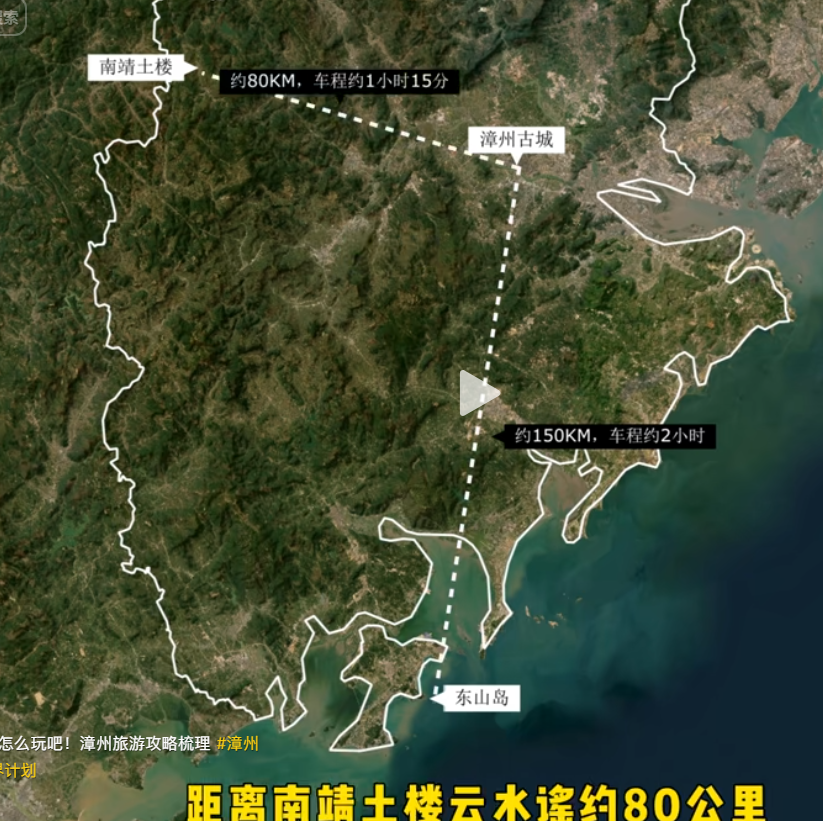
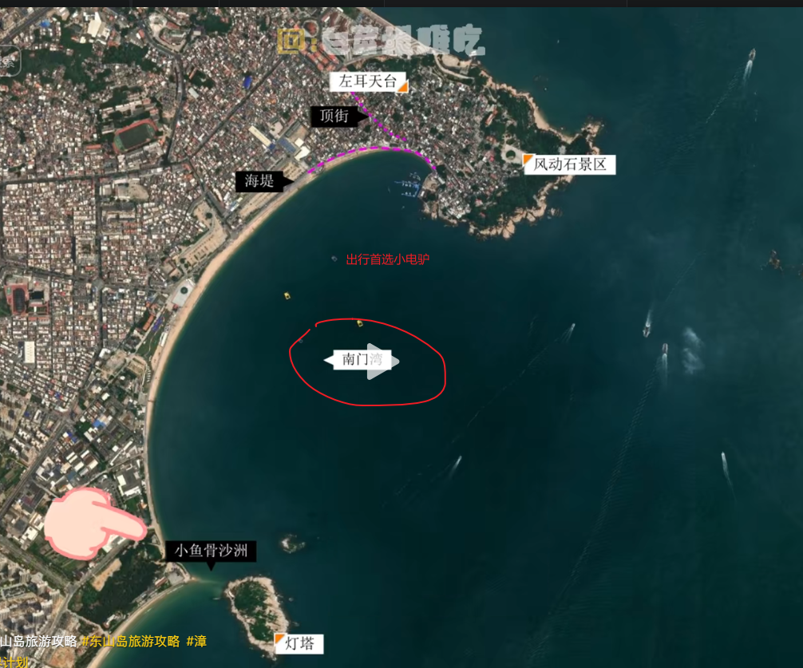
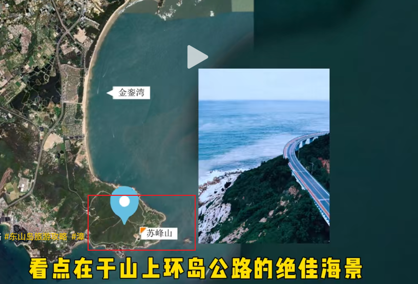
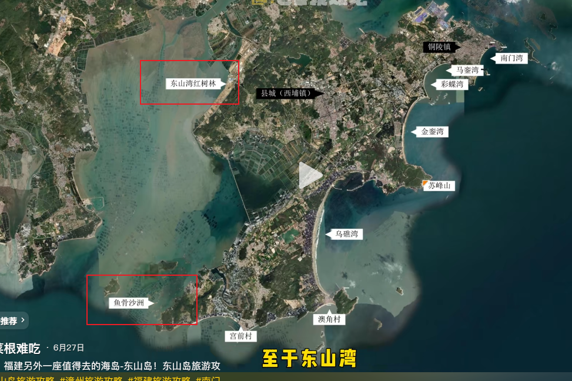
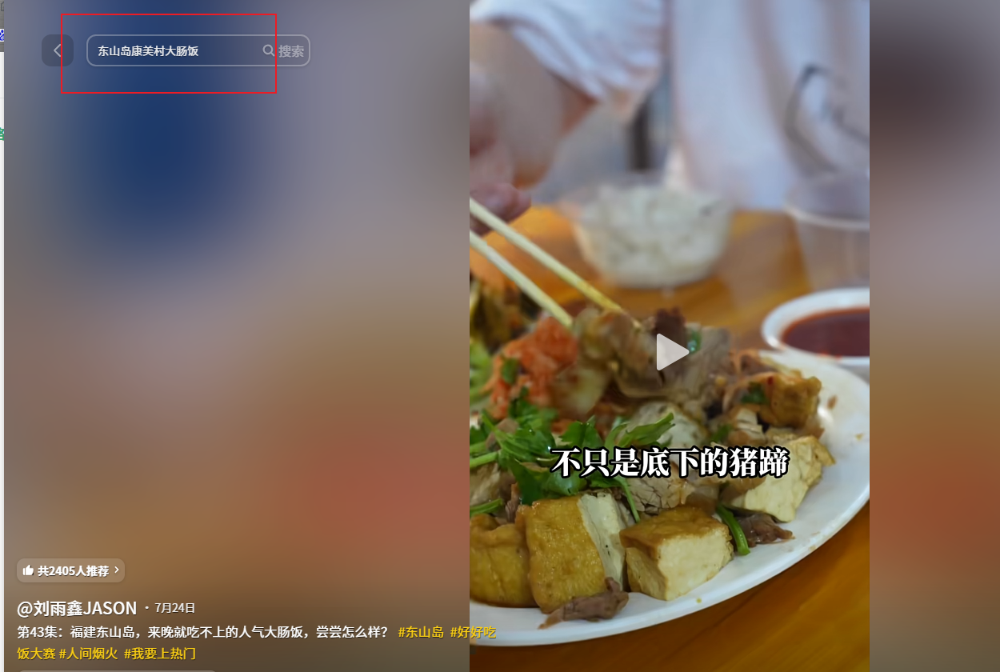
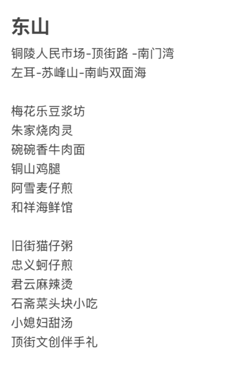
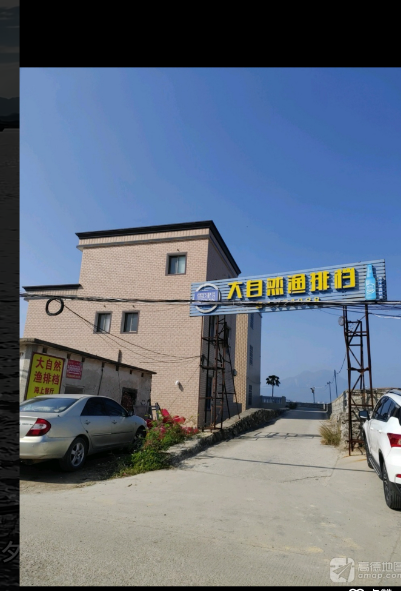
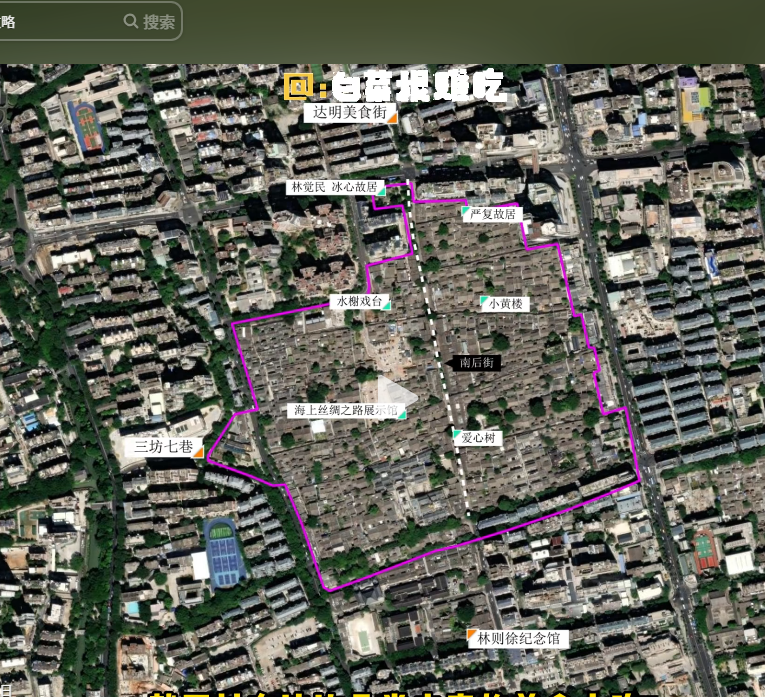
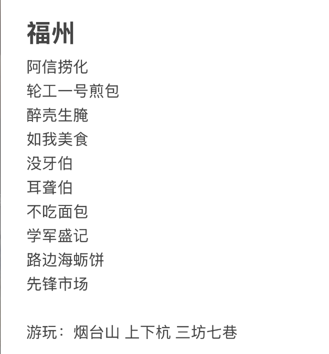

# 福建旅游攻略

## 景点概览

## 景区地图

## 热门打卡点

### 南门弯
::: tip 景点特色
南门弯是一处著名的观景打卡点，以其独特的弯道和优美的自然风光闻名。
:::

### 金銮弯
::: tip 景点特色
金銮弯以其壮观的地形和绝美的景色著称，是摄影爱好者的必选之地。
:::

## 其他景点
::: tip 景点导览
这里汇集了其他值得一游的特色景点，每个景点都有其独特的魅力。
:::

## 美食推荐

::: tip 美食导览
福建不仅有美丽的风景，还有令人垂涎的特色美食。这里为您推荐几款不容错过的当地佳肴。
:::

## 福州行程攻略

::: tip 交通提示
选择高铁站攻略：
- 福州站：靠近市区，交通便利
- 福州南站：距离市区较远，建议提前规划路线
:::

### 必游景点

#### 三坊七巷
::: tip 景点特色
福州最著名的历史文化街区，是闽都古城的缩影，也是绝佳的住宿选择。
:::

#### 福建西湖公园
::: tip 景点特色
福州市区内重要的人文景观，晨间可观看升旗仪式，感受庄严时刻。
:::

### 实景预览

::: tip 更多参考
详细行程可参考抖音博主「大橘小狸环游记」的专业攻略。
:::

