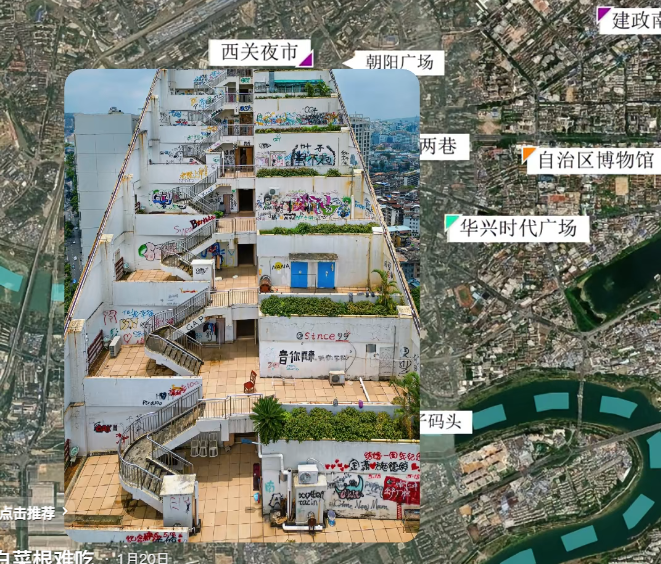
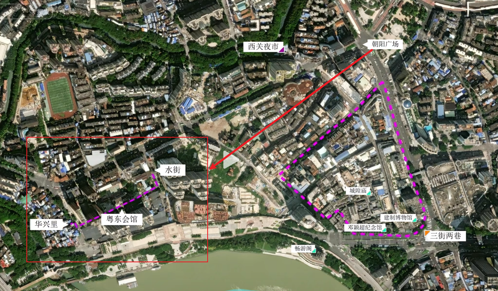
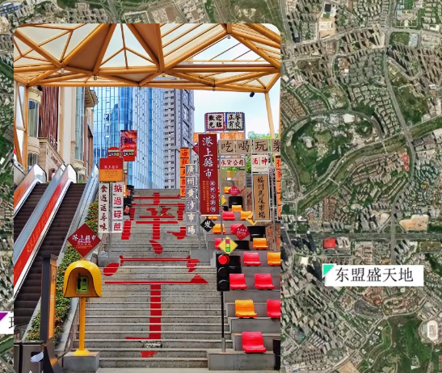
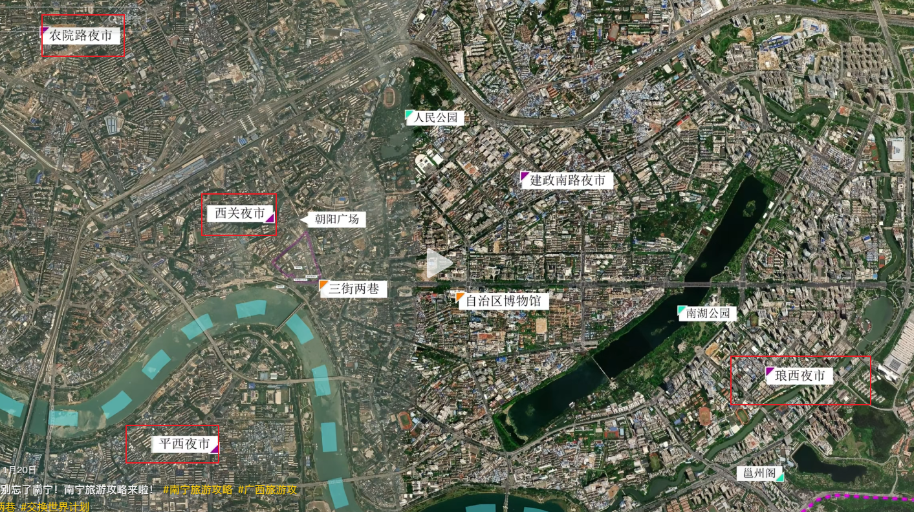

# 南宁旅游攻略

## 南宁市区两日游

### 第一天行程

1. **交通与住宿**
   - 抵达南宁高铁站
   - 入住酒店
   - 享用午餐
     > 推荐：
     > - 芬姐老牌粉店（老友粉）
     > - 柳爽爽螺蛳粉（思贤店，巷子内，旁边有凉皮店）
     > - 钟姐老牌炖品店

2. **下午游览**
   - 公园游览路线：
     * 南湖公园
     * 人民公园
     * 亭子码头（适合拍照打卡）

3. **傍晚行程**
   - 华兴时代广场
     
   - 三街两巷（历史文化街区）
     > 美食推荐：苏十老友(三街两巷店)

4. **夜晚活动**
   - 西光夜市（位于朝阳广场附近）

### 第二天行程

1. **早晨行程**
   - 双孖井早市（体验地道早市文化）
   - 鸳鸯楼（历史建筑）

2. **上午至中午**
   - 水街文化游览
     * 粤东会馆
     * 华兴里
     
     > 美食推荐：梁阿婆廿年老牌扣肉糯米饭

3. **下午行程**
   - 东盟盛天地（现代商业区）
     
   - 青秀山景区（建议预留半天时间）
     > 提示：景区范围较大，建议提前观看攻略视频规划路线
     > 
     > 周边美食：
     > - 龙上水现炒生料粉
     > - 侏罗纪爆炒生料

4. **夜晚活动**
   - 平西夜市

### 南宁特色夜市推荐

- 西光夜市（朝阳广场附近）
- 琅西夜市
- 农院路夜市
- 平西夜市

## 特色美食推荐

### 人气餐厅

1. **苏十老友**
   - 三街两巷店（白天）
   - 龙胜街店（晚上排队王）
     > 地址：南宁市西乡塘区华强街道龙胜街7-2号

2. **特色餐厅**
   - 韦姐烧烤店
   - 博白博港簸箕炊美食店（总店）

## 百色